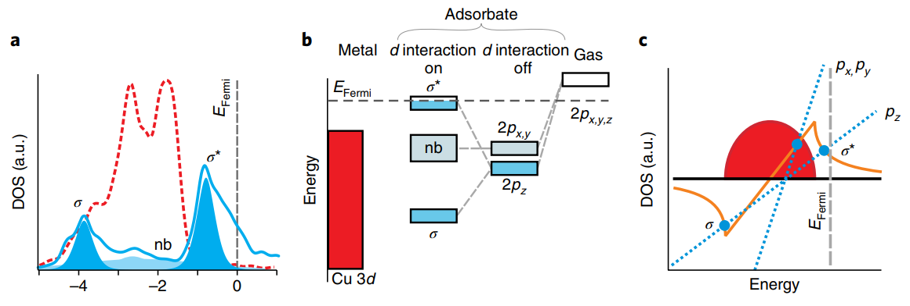
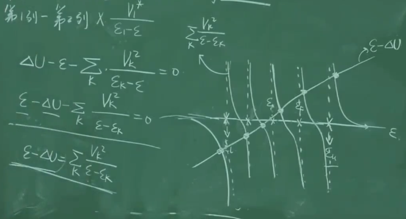
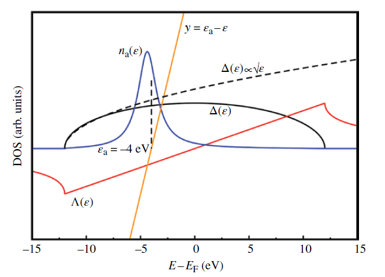
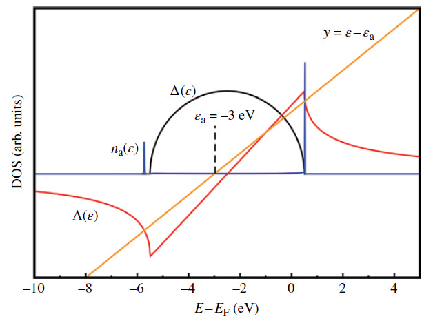
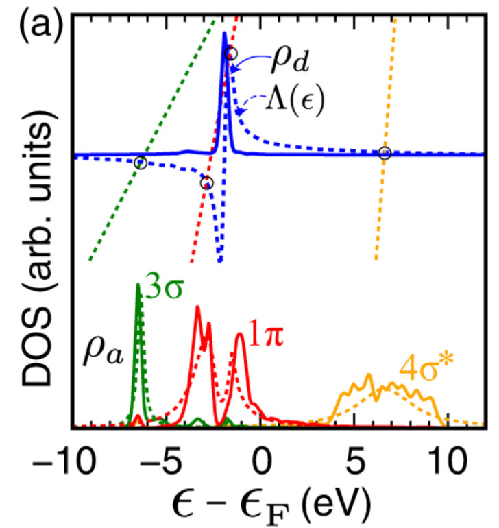
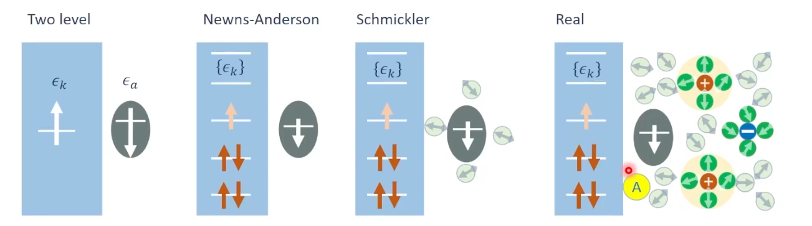

# Newns-Anderson-Schmickler

So how does a metal interact with a molecule? How does electron transfer happen? And what role does the solvent play?

There is also something fun here. We actually use harmonic oscillators and the central limit theorem to describe a huge amount of what happens in solution.

## Main Line of This Note

The main line of this note can be reduced to three steps.

1. Start from the **Anderson model** and use the **Green function** to write the coupling between a localized electronic state and a continuous metal band in terms of the **density of states (DOS)**.
2. Move to the **Newns-Anderson model** and see how an adsorbate level shifts, broadens, and splits into bonding and antibonding states.
3. Finally, move to the **Schmickler model** and add electrode potential, the **fast and slow solvent variables**, and **reorganization energy** to the picture of electron sharing.

In the middle, there is also a section about harmonic oscillators, the **central limit theorem**, and **Einstein's fluctuation theory**. I find this part very interesting because it helps explain why such a complicated solvent can be represented using simple harmonic modes.

{fig-align="center" width="723"}

**Let us look at the figure first to understand Newns-Anderson. Start from the right side of panel b and move left. An isolated gas-phase molecule has molecular orbitals such as 2p$_x$, 2p$_y$, and 2p$_z$. When the molecule approaches the surface, these orbitals interact with the metal d orbitals. The better the symmetry match between a molecular orbital and a metal d orbital, the more stable the bonding interaction becomes and the lower the energy goes. The 2p$_z$ orbital couples better, so its energy moves lower and it forms bonding and antibonding states. The 2p$_x$ and 2p$_y$ orbitals have poorer symmetry matching and form nonbonding states (nb). In panel a on the left, the DOS tells us how the metal distributes its electrons over different energy levels. The continuous curve is just a mathematical treatment of many closely spaced states. The red part is the Cu 3d band. We can also see that electrons are filled only below the Fermi level. The more electrons that fill bonding states, the stronger the adsorption tends to be. The more electrons that fill antibonding states, the weaker the adsorption becomes.**

## 1. Anderson

### Where the Anderson model came from

Why is it that when a very small amount of a magnetic transition-metal atom, such as Fe, is added as an impurity to a nonmagnetic metal such as Cu, some impurities keep their magnetism while others lose it?

The mathematical picture of an "isolated localized state interacting with a continuous band" fits the physical picture of surface chemisorption extremely well. Eight years later, D. M. Newns borrowed this framework and turned it into one of the basic models of adsorption.\[1,2\]

Before that, let us introduce the Green function.

My mathematics is not very strong, and this time I do not really understand the geometric picture or physical meaning of the Green function. So for now, I am just going to use it as a tool.

Let us first look at the relation between the Green function and the density of states.

### Relation between the Green function and the density of states

In quantum physics and solid-state physics, the Green function can be connected to the density of states, which gives it a physical meaning.

The density of states (DOS) is defined as

$$
\rho(E)=\sum_j\delta(E-E_j)
\tag{1}
$$

The DOS tells us how electronic states are distributed over energy.

Here, $\delta$ is not an ordinary function that is simply 0 or 1. When $E\neq E_j$, it is 0. At $E=E_j$, it represents one state in the sense of an integral.

For convenience, I will use Dirac notation from here on.

The same Hamiltonian acting on different eigenstates gives different eigenvalues, so we define

$$
\hat{H}\psi_j=E_j\psi_j
\tag{2}
$$

For now, do not worry about where the Green function comes from. I am treating it as a tool because we are not doing pure mathematics here.

You can imagine that we are just trying different operators and asking: what operator acting on $\psi_j$ can eventually give us the DOS?

People found that the Green-function operator gives

$$
\langle\psi_j|G|\psi_j\rangle
=
\langle\psi_j|(E-\hat{H})^{-1}|\psi_j\rangle
=
(E-E_j)^{-1}\langle\psi_j|\psi_j\rangle
\tag{3}
$$

From the orthonormality of the eigenstates,

$$
\langle\psi_i|\psi_j\rangle=\delta_{ij}
\tag{4}
$$

so

$$
\langle\psi_j|G|\psi_j\rangle=(E-E_j)^{-1}
\tag{5}
$$

Summing over $j$ gives

$$
\sum_j\langle\psi_j|G|\psi_j\rangle
=
\sum_j(E-E_j)^{-1}
\tag{6}
$$

In quantum mechanics, an operator can be written as a matrix.

The expression above can be viewed as the sum of the diagonal elements of that matrix. Terms such as $\langle\psi_1|G|\psi_2\rangle$ or $\langle\psi_3|G|\psi_2\rangle$ are not on the diagonal.

So this is the matrix trace:

$$
\operatorname{Tr}G(E)=\sum_j(E-E_j)^{-1}
\tag{7}
$$

Now compare this with the definition of the DOS:

$$
\rho(E)=\sum_j\delta(E-E_j)
\tag{8}
$$

At this point, we can already see that there should be a connection between the Green function and the DOS. The only thing missing is the $\delta$ function.

So the next step is to make the $\delta$ function appear from the Green function.

### From the Plemelj formula to DOS — do not worry, it is just a mathematical trick

To avoid a zero denominator, introduce a complex energy:

$$
E\rightarrow E+is
\tag{9}
$$

and define

$$
\xi_j=E-E_j
\tag{10}
$$

Then

$$
\sum_j\langle\psi_j|G|\psi_j\rangle
=
\sum_j(\xi_j+is)^{-1}
\tag{11}
$$

Now the mathematicians give us another tool, the **Plemelj formula**:\[3\]

$$
\frac{1}{\xi+i0^+}
=
\mathcal{P}\frac{1}{\xi}
-i\pi\delta(\xi)
\tag{12}
$$

Therefore,

$$
\sum_j(\xi_j+i0^+)^{-1}
=
\sum_j
\left[
\mathcal{P}\left(\frac{1}{\xi_j}\right)
-i\pi\delta(\xi_j)
\right]
\tag{13}
$$

We only care about the $\delta$-function part here, so we take the imaginary part:

$$
\operatorname{Im}\sum_j(\xi_j+i0^+)^{-1}
=
-\pi\sum_j\delta(\xi_j)
=
-\pi\sum_j\delta(E-E_j)
\tag{14}
$$

Returning to the definition of the DOS, we obtain the relation between the Green function and the DOS:

$$
\operatorname{Im}\sum_j
\langle\psi_j|G(E)|\psi_j\rangle
=
-\pi\rho(E)
\tag{15}
$$

Since

$$
\operatorname{Tr}G(E)
=
\sum_j\langle\psi_j|G(E)|\psi_j\rangle
\tag{16}
$$

the more common form is

$$
\rho(E)
=
-\frac{1}{\pi}
\operatorname{Im}\operatorname{Tr}G^R(E)
\tag{17}
$$

### Local density of states and the retarded Green function

Here, $G^R(E)$ is the **retarded Green function**:

$$
G^R(E)
=
\frac{1}{E-\hat H+i0^+}
\tag{18}
$$

For one specific state $a$, we define the **local density of states** as $\rho_a(E)$:

$$
\rho_a(E)
=
-\frac{1}{\pi}
\operatorname{Im}G_{aa}^R(E)
\tag{19}
$$

where

$$
G_{aa}^R(E)
=
\langle a|G^R(E)|a\rangle
\tag{20}
$$

In other words,

$$
\operatorname{Im}G_{aa}^R(E)
=
-\pi\rho_a(E)
\tag{21}
$$

##### So if you want the DOS, you first need to find the imaginary part of the Green function $G_{aa}$.

### Other ways to understand it and some useful resources

https://www.mozheyang.top/2018/01/15/QMGreenFunction/ Chinese \[4\]

There is also a video by Jun Huang from *Jülich*. Around 34:00, he explains some details of using Green functions to derive the Anderson model.\[5\]

https://www.koushare.com/video/details/33369?series_id=2063 Chinese video, English slides.

You can also follow Jens Nørskov's *Fundamental Concepts in Heterogeneous Catalysis*, page 185, in the chapter "THE NEWNS-ANDERSON MODEL", and see $G_{aa}$ directly from the matrix form.\[6\]

Or you can start from a more linear-algebra-based picture, closer to the formation of molecular orbitals from a two-level model. The following video is useful for that.

If you are really not familiar with Green functions, you can also use the secular equation directly. After some work with the determinant, you obtain one adsorbate line and a series of intersections with the metal electronic states. You can see that when the adsorbate and metal share electrons and form new states, the stable states move toward lower energy.

Later, the result can be evaluated using contour integration. This is discussed around 43 minutes in the video below.

{fig-align="center" width="541"}

https://www.koushare.com/video/details/70117 \[7\]

If you go through the derivation carefully, you may notice that the *free-d state* paper in *Nature Chemistry* actually has a problem.\[8\]

## 2. Newns-Anderson: electron sharing between an adsorbate and a metal

### **adsorbate-projected DOS**

Anyway, the result is that we can obtain the adsorbate-projected DOS, or in other words, the DOS after the adsorbate and metal surface are coupled together.\[2,6\]

$$
n_a(\varepsilon)
=
-\frac{1}{\pi}\operatorname{Im}G_{aa}(\varepsilon)
=
-\frac{1}{\pi}\operatorname{Im}
\left(
\frac{1}
{\varepsilon-\varepsilon_a-\Lambda(\varepsilon)+i\Delta(\varepsilon)}
\right)
\tag{22}
$$

Here, $\varepsilon_k$ represents the electronic levels of the metal, $\varepsilon_a$ is the molecular electronic level, and $\varepsilon$ is simply the x-axis when you plot the DOS.

Multiplying the argument by its complex conjugate in the numerator and denominator and extracting the imaginary part, we get

$$
n_a(\varepsilon)
=
\frac{1}{\pi}
\frac{\Delta(\varepsilon)}
{\left(\varepsilon-\varepsilon_a-\Lambda(\varepsilon)\right)^2+\Delta(\varepsilon)^2}
\tag{23}
$$

### Coupling broadening $\Delta(\varepsilon)$ and energy shift $\Lambda(\varepsilon)$

For the molecule,

$$
\Delta(\varepsilon)
=
\pi \sum_k V_{ak}^2 \, \delta(\varepsilon-\varepsilon_k)
\tag{24}
$$

The physical meaning is how strongly each metal state couples directly to the molecular state.

The coupling strength mainly depends on how much the two wavefunctions overlap. In other words, it is related to projecting one wavefunction onto another.

Suddenly this starts to look like something where we could bring in the Wigner-Eckart theorem or group theory again, haha.

The molecular $\Lambda(\varepsilon)$ is the **energy shift function** of the adsorbate orbital.

Physically, it describes how the resonance center of an isolated atomic or molecular level shifts after hybridization with the metal surface.

It is the shift of the intersection picture we just discussed relative to the original level.

Mathematically, it is also the real part that appeared earlier in the Plemelj formula:

$$
\Lambda(\varepsilon) = \mathcal{P} \sum_k \frac{\vert{}V_{ak}\vert{}^2}{\varepsilon - \varepsilon_k}
\tag{25}
$$

Here, $\mathcal{P}$ is the Cauchy principal value. It means that during the integral or summation, we carefully remove the singular point at $\varepsilon=\varepsilon_k$, where the denominator becomes zero.

In practical calculations or code, $\Lambda(\varepsilon)$ is the Hilbert transform of $\Delta(\varepsilon)$.

{fig-align="center" width="490"}

### Resonance broadening and Electron Lifetime

The $n_a(\varepsilon)$ in the figure is the DOS of the molecule after adsorption.

Here, $\Delta(\varepsilon)$ is coupled to the broad sp electrons, so it is very wide, roughly from -10 eV to 15 eV.

The crossing of the red and orange curves shows how a single molecular orbital shifts slightly and broadens after adsorption on the metal surface. The electron is now shared between the molecule and the metal.

This broadening is also related to **Electron Lifetime**.

In the physical picture, **the broader the resonance peak, the shorter the time an electron stays on the adsorbate**. A broad peak usually also means that $V_{ak}$ is large.

For a resonance state with a finite lifetime, the energy width and decay time follow the linewidth-lifetime Fourier relation. Heuristically, we can write

$$
\Delta E \cdot \Delta t \ge \frac{\hbar}{2}
\tag{26}
$$

In the Green-function picture of surface adsorption:

- **Energy uncertainty** $(\Delta E)$ is the linewidth of the Lorentzian-like peak in the projected DOS $n_a(\varepsilon)$, that is, the broadening $\Delta$.

- **Time scale** $(\Delta t)$ corresponds to the characteristic time that the electron stays in the adsorbate orbital, the $\vert{}a\rangle$ state. This is the **electron lifetime** $\tau$.

So the two are inversely related:

$$
\tau \approx \frac{\hbar}{2\Delta}
\tag{27}
$$

From the viewpoint of electron transfer, this means that sp electrons broaden the adsorbate level into a **very broad background**, often several eV wide. The lifetime of the electron on the adsorbate is then extremely short.

By comparison, d orbitals are much more localized.

The coupling between the adsorbate and the d band is usually weaker, so electron transfer across the boundary happens less often.

As a result, the interaction with d electrons often appears as **narrower resonance peaks in the DOS, usually with a width below about 1 eV**. The electron is more localized and its lifetime is longer.

### d-band, antibonding states, and adsorption strength

{fig-align="center" width="457"}

In Nørskov's book, the occupation of antibonding states is treated as one of the most important factors.

If electrons are removed from the antibonding states, the system gains a large amount of hybridization energy.

Therefore, **the higher $\epsilon_d$ is, the stronger the adsorption tends to be.**

The figure below shows two small peaks in $n_a(\varepsilon)$. The peak above 0 eV is the antibonding state.\[6\]

{fig-align="center" width="353"}

The upper part of the figure shows the metal d orbitals, the blue $\rho_d$, together with the molecular orbitals and the interaction strength between the molecule and the metal, shown by the dashed lines of different colors.

The blue $\rho_d$ represents the metal d band. The different dashed lines represent different molecular orbitals, and their slopes indicate different interaction strengths.

The lower part shows the DOS of the molecule after the interaction.

*Infusing theory into deep learning for interpretable reactivity prediction*, *Nature Communications* 2021, Hongliang Xin. \[Remember to add the citation for this figure\]

### Exceptions to the d-band center and Pauli repulsion

Hongliang Xin and co-workers developed this picture further.

For OH, F, and Cl adsorbed on Pt- and Pd-skin alloys, the d-band-center picture starts to fail.

When both the adsorbate state and the metal state are **fully occupied**, the energy gain from lowering the bonding state is cancelled by the energy cost of filling the antibonding state.

They introduced an orthogonalization penalty caused by the overlap $S_{ad}$, that is, Pauli repulsion, to explain this behavior.

At this point, the basic picture of how metal sp and d states interact with adsorbates is already quite complete.\[9\]

## 3. Schmickler: from adsorption in vacuum to electrochemistry

Let us enter the electrochemical world through the direct relation between the PZC **[PZC](Potential_of_Maximum_Entropy_PME_and_PZC_new.en.md)** and the metal work function.

::: {style="text-align: center;"}

:::

In the 1960s, Trasatti noticed a relation between the electrochemical behavior of metals and their electronic structure.

He found a linear relation between the metal **work function (WF)** and the potential of zero charge (PZC).

In a 1971 paper, he proposed the following well-known relations:\[1\]

$$
\mathrm{PZC}=WF-4.61-0.666(2.10-X)
\tag{1}
$$

For zinc, indium, and aluminum,

$$
X=0.5WF-0.55
\tag{2}
$$

For alkali metals, alkaline-earth metals, and sp metals,

$$
X=0.5WF-0.29
\tag{3}
$$

For transition metals, $X=1.5$.\[1\]

Trasatti collected WF and PZC data for a series of metals.

He found that there was no single universal rule. Transition metals and sp metals followed different trends.\[1\]

He then asked why these two groups behave differently.

He found that the metal surface plays a major role in polarizing interfacial water.

Transition metals interact strongly with interfacial water through chemisorption, while sp metals mainly change water orientation through electrostatic interactions.

For sp metals, the orientational polarization of water can be related to the electronegativity of the metal.\[1\]\[2\]

This is actually very interesting.

How can we use a model to connect the sp-electron contribution to adsorption in Newns-Anderson with the role of sp metals in the electric double layer?

I will write about this when I have time.

### From the interface to interfacial water

Based on the Newns-Anderson model, *Schmickler* (*PHYSICAL REVIEW B* 79, 235436, 2009, DOI: 10.1103/PhysRevB.79.235436) added solvation and electrode potential to the adsorbate picture.

He separated the solvent response into a fast part and a slow part.\[10\]

During electron transfer, the solvent does not respond to a change in charge all at once:

- **Fast variables (Fast electronic modes):** these come from the electronic polarization of solvent molecules. Because electrons move very quickly, the response time is around $10^{-16}-10^{-15}\ \text{s}$. The fast variables can therefore follow the slow variables and electron transfer **adiabatically**. Their physical role is to respond almost immediately and **renormalize the electronic energy level**. They do not form the kinetic barrier of the reaction.

- **Slow variables (Slow solvent modes):** these come from the overall orientation and structural distortion of solvent molecules, such as atomic motion. Their response time is around $10^{-14}-10^{-11}\ \text{s}$. These slow variables cannot follow an electronic jump instantly. They can only evolve through thermal **fluctuations**. These fluctuations move the adsorbate energy level. When the level reaches the right position, electron transfer can occur.

Schmickler wrote these slow variables explicitly into the Hamiltonian.

He modeled them as a **phonon bath**, a set of harmonic oscillators that interact linearly with the charge of the reactant.

### Why are harmonic oscillators so useful?

Here is something I find interesting.

Have you ever wondered why harmonic oscillators are so useful?

One reason is that harmonic-oscillator states form a very good orthogonal basis, a bit like $x,y,z$.

More formally, the eigenstates of the harmonic oscillator, whose wavefunctions are built from Hermite polynomials, form a complete orthogonal basis.

Just as a vector in three-dimensional space can be written using $(x,y,z)$, a complicated wavefunction can be written as a linear combination of harmonic-oscillator basis states. The idea is similar to a Fourier expansion.

Vibrational modes can also be treated in this way.

Once we decompose motion into modes, we can build up the vibrations that appear in SFG, SHS, Raman, and IR spectra.

There is another reason.

### From a quadratic potential to a Gaussian distribution

For any complicated system near a stable equilibrium point, the potential-energy function $V(x)$ can be expanded around $x_0$:

$$
V(x) = V(x_0) + V'(x_0)(x-x_0) + \frac{1}{2}V''(x_0)(x-x_0)^2 + \mathcal{O}((x-x_0)^3)
\tag{28}
$$

At equilibrium, the first derivative, or force, must be zero:

$$
V'(x_0)=0
$$

If we take $V(x_0)=0$ and ignore the higher-order terms, the potential naturally becomes the familiar parabola we learned in middle school:

$$
V(x) \approx \frac{1}{2}V''(x_0)(x-x_0)^2 = \frac{1}{2}k x^2
\tag{29}
$$

Now put this potential into the Boltzmann distribution.

In thermodynamics, if the energy, or Hamiltonian, has the harmonic form $H=\frac12kx^2$, then the probability density of the system being at $x$ is

$$
P(x) \propto \exp\left(-\frac{H}{k_B T}\right) = \exp\left(-\frac{k x^2}{2 k_B T}\right)
\tag{30}
$$

Look at that.

**A quadratic energy directly gives a perfect Gaussian distribution inside the exponential.**

### From the central limit theorem to Einstein's fluctuation theory

A solvent contains an enormous number of molecules, on the order of Avogadro's number, $10^{23}$.

All of their microscopic dipole moments are fluctuating.

According to the central limit theorem, under the conditions where it applies, the sum of many independent or weakly correlated random variables tends toward a **Gaussian distribution**.

So we can work backward.

If the macroscopic statistics should be approximately Gaussian, then we want an effective energy that is quadratic. And if the energy is quadratic and we also want an orthogonal mode description, harmonic-oscillator modes are a natural choice.

This is how I like to understand it.

In 1910, Einstein approached the idea in the forward direction. He connected these ideas through **fluctuation theory**.\[11\]

Suppose we observe a macroscopic system, for example a group of liquid-water molecules around an adsorbate.

This water contains about $10^{23}$ molecules, and the molecules are correlated with each other.

- **Starting from mathematics (CLT):** we look at a macroscopic polarization coordinate $q$, which is the sum of a huge number of molecular dipoles. According to the central limit theorem, when its conditions are satisfied, the fluctuations of $q$ around its equilibrium value $q_0$ tend toward a Gaussian distribution:

$$
P(q) \propto \exp(-A(q - q_0)^2)
\tag{31}
$$

- **Starting from physics (Boltzmann):** from the Boltzmann entropy relation, the probability of finding the system in state $q$ is proportional to the number of microscopic states corresponding to that macroscopic state:

$$
P(q) \propto \exp\left(\frac{S(q)}{k_B}\right)
\tag{32}
$$

**Here is the nice part.**

We compare the right-hand sides of these two equations.

If the probability is approximately Gaussian, then the physical quantity in the exponent should also have a corresponding quadratic form.

Expand the macroscopic entropy $S(q)$ around the equilibrium point $q_0$:

$$
S(q) = S(q_0) + S'(q_0)(q - q_0) + \frac{1}{2}S''(q_0)(q - q_0)^2 + \dots
\tag{33}
$$

At equilibrium, the entropy is at a maximum, or the free energy is at a minimum. Therefore,

$$
S'(q_0)=0
$$

Ignoring higher-order terms, the entropy change becomes

$$
\Delta S = \frac{1}{2}S''(q_0)(q - q_0)^2
\tag{34}
$$

Putting this into the probability expression gives

$$
P(q) \propto \exp\left(\frac{\frac{1}{2}S''(q_0)(q - q_0)^2}{k_B}\right)
\tag{35}
$$

Because $S''(q_0)$ is negative at the maximum, **the fluctuation probability obtained from the Boltzmann relation becomes a Gaussian distribution in exactly the same mathematical form.**

### Summary

- The **central limit theorem** tells us that, when its conditions are satisfied, the fluctuation of a macroscopic variable built from many microscopic degrees of freedom tends toward a form like $\exp(-x^2)$.

- The **Boltzmann relation** tells us that the probability of a macroscopic variable is controlled by $\exp(-\frac{\Delta G}{k_B T})$, where $\Delta G$ is the free-energy change.

- Putting these two ideas together means that **the effective free-energy surface, or potential-energy surface, of a complicated macroscopic system can be approximated by a quadratic parabola near equilibrium**:

$$
\Delta G \propto x^2
$$

### The key approximation here: linear response

Of course, the force on a harmonic oscillator is the negative gradient of the potential:

$$
F=-\frac{dV}{dx}
$$

Treating the force as linear is the linear-response assumption.

Equivalently, we are assuming that the potential is approximately parabolic and ignoring higher-order terms.

Sometimes this approximation can break down.

For example, adding ions or a strong electric field to a solution may make the response nonlinear.

So keep this in mind:

Marcus/Schmickler theory is built on a linear-response picture.

### A side thought: the central limit theorem, path integrals, and SHS

The derivation and mathematical core of the central limit theorem are also really interesting.

Take a look at this \[3Blue1Brown\] video:

https://www.youtube.com/watch?v=zeJD6dqJ5lo \[12\]

Sorry, my ADHD brain does not have an off switch for jumping between ideas.

This suddenly made me think of Veritasium's video about path integrals.

Could the phase in that picture have some relation to phase in SHS?

In SHS papers, people often use heavy-water isotope experiments to identify a vibration or to see whether nuclear quantum effects are important.

In PIMD, we even turn each water molecule into a little ring for the calculation.

https://www.youtube.com/watch?v=qJZ1Ez28C-A \[13\]

### Back to Schmickler's solvent model

Okay, back to Schmickler's solvent model.

I almost forgot the main line again.

Let us return to the fast and slow solvent responses during electron transfer.

- **Fast variables (Fast electronic modes):** these come from electronic polarization of solvent molecules. Because electrons move very quickly, the response time is around $10^{-16}-10^{-15}\ \text{s}$. The fast variables can follow the slow variables and the electron-transfer process **adiabatically**. They respond almost instantly and **renormalize the electronic level**. They do not create the kinetic barrier.

- **Slow variables (Slow solvent modes):** these come from overall molecular orientation and structural distortion, such as atomic motion. Their response time is around $10^{-14}-10^{-11}\ \text{s}$. These modes cannot follow an electron jump instantly. They evolve through thermal fluctuations. These fluctuations move the adsorbate level, and electron transfer occurs when the level reaches the right position.

### Multidimensional solvent modes and reorganization energy

For multidimensional solvent and inner-sphere reorganization, the Hamiltonian is written as

$$
H_{\mathrm{sol}}
=
\sum_i
\left\{
\frac{1}{2}\alpha_i x_i^2
+
\alpha_i x_i g_i(1-n)
\right\}
\tag{36}
$$

- $x_i$ is the coordinate of the $i$th mode.

- $\alpha_i$ is the force constant of the harmonic oscillator. For a real harmonic oscillator, $\alpha_i=m_i\omega_i^2$.

- $(1-n)$ is the charge state of the reactant, with $n=1$ for the initial state and $n=0$ for the final state.

- $g_i$ is the linear coupling constant between the charge and the $i$th solvent mode.

To simplify the mathematics, introduce the dimensionless coordinate

$$
q_i=x_i/g_i
$$

and define the contribution of the $i$th mode to the reorganization energy as

$$
\lambda_i=\alpha_i g_i^2/2
$$

Then the energy surface can be written in the more general form

$$
E(q_i) = \epsilon_a n + \sum_i \left\{ \lambda_i q_i^2 + 2\lambda_i q_i(1-n) \right\}
\tag{37}
$$

where $\epsilon_a$ is the electronic level after the fast-variable renormalization has been included.

You can also look at our derivation of the Marcus outer-sphere reorganization energy from electrostatics:

**[Outer reorganization](electrostatics and Outer-sphere reorganization energy_new.en.md)**

Let me add two comments here.

The $q_i$ here refers to normal-mode coordinates. It is not just any random vibration that appears in an IR spectrum.

The parameter $g_i$ is becoming more and more important in my view. It tells us how much a particular vibrational mode contributes to the Hamiltonian.

Later, when we derive the relation between reorganization energy from the energy-gap correlation function and molecular vibrations, this parameter becomes critical.

At the moment, we often have to learn it from AIMD first and then connect it back to spectroscopy to obtain reorganization-energy information.

I do not know whether Roke's CVS can help solve this problem.

Now we move to the standard next step.

### Deriving the activation energy (Saddle Point)

Electron transfer occurs along the intersection of two multidimensional parabolic surfaces, the initial state $n=1$ and the final state $n=0$.

To find the transition state along the reaction path, we need the **saddle point**, the lowest-energy point on that intersection.

**Step 1: Write the intersection condition**

At the crossing point, the energy of the initial state equals the energy of the final state:

$$
\epsilon_a + \sum_i \lambda_i q_i^2 = \sum_i \left\{ \lambda_i q_i^2 + 2\lambda_i q_i \right\}
\tag{38}
$$

This simplifies to the constraint

$$
2\sum_i \lambda_i q_i - \epsilon_a = 0
\tag{39}
$$

**Step 2: Use a Lagrange multiplier to find the minimum**

Introduce a Lagrange multiplier $\mu$ and minimize

$$
F(q_i) = \epsilon_a + \sum_i \lambda_i q_i^2 + \mu\left(2\sum_i \lambda_i q_i - \epsilon_a\right)
\tag{40}
$$

Take the derivative with respect to $q_i$ and set it to zero:

$$
q_i = -\mu
\tag{41}
$$

Substitute $q_i$ back into the constraint:

$$
2\sum_i \lambda_i (-\mu) - \epsilon_a = 0 \quad \Rightarrow \quad \mu = -\frac{\epsilon_a}{2\lambda}
\tag{42}
$$

where

$$
\lambda=\sum_i\lambda_i
$$

is the total reorganization energy.

**Step 3: Obtain the activation energy**

Substitute

$$
q_i=\frac{\epsilon_a}{2\lambda}
$$

back into the initial-state energy.

The absolute energy at the saddle point is

$$
E^{\ddagger} = \epsilon_a + \sum_i \lambda_i \left(\frac{\epsilon_a}{2\lambda}\right)^2 = \epsilon_a + \frac{\epsilon_a^2}{4\lambda}
\tag{43}
$$

Relative to the minimum of the initial state,

$$
E_{i,\min}=\epsilon_a
$$

the activation energy is

$$
E_{\mathrm{act}}=E^{\ddagger}-\epsilon_a=\frac{\epsilon_a^2}{4\lambda}
\tag{44}
$$

#### **Summary:** Schmickler's derivation shows that whether we start from a microscopic multidimensional phonon-bath model or from Marcus' macroscopic dielectric-polarization model, the central idea is the same. We separate the variables that can follow the electronic jump, the "fast variables," and absorb them into the energy reference. Then we keep the "slow variables," which control thermal fluctuations and the formation of the transition state. These slow variables are the source of $\lambda_{\mathrm{out}}$. In the end, both routes lead to the same basic picture of an activation barrier for electron transfer.

{fig-align="center" width="729"}

https://www.koushare.com/video/details/51995 \[14\]

Jun Huang's Koushare lecture on Schmickler.\[14\]

## References

\[1\] Anderson, P. W. “Localized Magnetic States in Metals.” *Physical Review* **124** (1961): 41–53. https://doi.org/10.1103/PhysRev.124.41

\[2\] Newns, D. M. “Self-Consistent Model of Hydrogen Chemisorption.” *Physical Review* **178** (1969): 1123–1135. https://doi.org/10.1103/PhysRev.178.1123

\[3\] Davison, S. G.; Sulston, K. W. *Green-Function Theory of Chemisorption*. Springer Science & Business Media, 2006.

\[4\] Mozhe. “Green Function in Quantum Mechanics.” 2018. https://www.mozheyang.top/2018/01/15/QMGreenFunction/

\[5\] Jun Huang. Koushare lecture/video. Discussion of the Anderson model and Green functions in a Jülich-related course or talk, around 34:00. https://www.koushare.com/video/details/33369?series_id=2063

\[6\] Nørskov, J. K.; Studt, F.; Abild-Pedersen, F.; Bligaard, T. *Fundamental Concepts in Heterogeneous Catalysis*. Wiley, 2014. Chapter 12, “The Newns–Anderson Model.” https://doi.org/10.1002/9781118892114

\[7\] Koushare video: understanding adsorbate-metal electronic-state coupling from a two-level / secular-equation picture. https://www.koushare.com/video/details/70117

\[8\] Greiner, M. T.; Jones, T. E.; Beeg, S.; et al. “Free-atom-like d states in single-atom alloy catalysts.” *Nature Chemistry* **10** (2018): 1008–1015. https://doi.org/10.1038/s41557-018-0125-5

\[9\] Xin, H.; Linic, S. “Exceptions to the d-band model of chemisorption on metal surfaces: The dominant role of repulsion between adsorbate states and metal d-states.” *The Journal of Chemical Physics* **132** (2010): 221101. https://doi.org/10.1063/1.3437609

\[10\] Santos, E.; Lundin, A.; Pötting, K.; Quaino, P.; Schmickler, W. “Model for the electrocatalysis of hydrogen evolution.” *Physical Review B* **79** (2009): 235436. https://doi.org/10.1103/PhysRevB.79.235436

\[11\] Einstein, A. “Theorie der Opaleszenz von homogenen Flüssigkeiten und Flüssigkeitsgemischen in der Nähe des kritischen Zustandes.” *Annalen der Physik* **338** (16) (1910): 1275–1298. https://doi.org/10.1002/andp.19103381612

\[12\] 3Blue1Brown. Video about the central limit theorem. https://www.youtube.com/watch?v=zeJD6dqJ5lo

\[13\] Veritasium. Video about path integrals. https://www.youtube.com/watch?v=qJZ1Ez28C-A

\[14\] Jun Huang. Koushare lecture/video about the Schmickler model. https://www.koushare.com/video/details/51995

\[15\] *Free-atom-like d states in single-atom alloy catalysts*. *Nature Chemistry* 2018. M. T. Greiner
