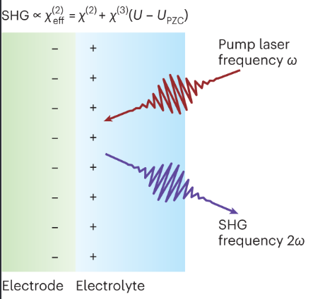
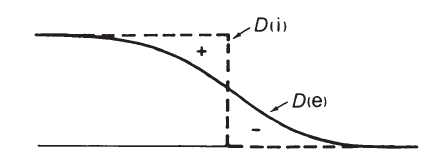
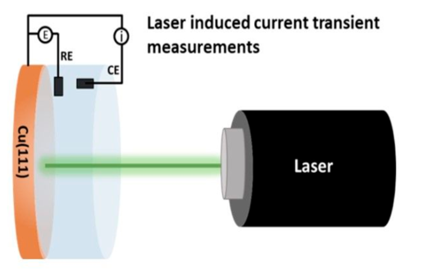
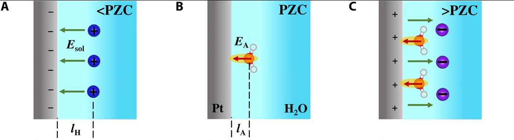
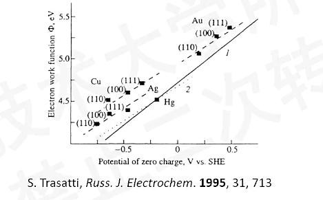
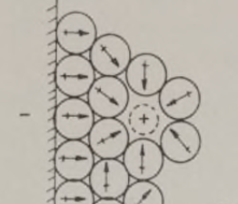
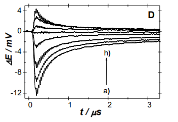

我们先来念一则悼词: 第一张图片是Manos Mavrikakis & Jin Suntivich Nature Materials 2023, 他们用SFG测量了金属水表面的PZC,这也几乎彻底宣告了用最大熵方法测量PZC已经死去.

或者在未来的动力学和传热的研究中还能见到它.

但最大熵方法,仍然是一个足够启发性的实验,我们先介绍什么是PZC,再介绍PZC和表面水的关系,最后我们再介绍怎么用最大熵来测量它.

::: {style="text-align: center;"}

:::

由于表面金属原子的截断,金属几乎天然的溢出电子,如果所以往往天然金属表面不是没有电荷的.

::: {style="text-align: center;"}

:::

## 所以我们先介绍一些定义

::: {style="text-align: center;"}

:::

\[做一个引用\]Jun Cheng Science Advances 2020 [DOI: 10.1126/sciadv.abb1219](https://doi.org/10.1126/sciadv.abb1219)

### PZC **PZFC** **PZTC**

PZC (零电荷电势)：是指电极表面没有净电荷或过剩电荷时的电势。在上图中间图片就是PZC表示表面不带有任何电荷.

PZFC (零自由电荷电势)：是指电极表面真正的过剩自由电荷密度为零的电势。自由电荷代表了界面两侧真正的电荷过剩量。PZFC对应的自由电荷是电极上的真实电子电荷，它是双电层界面电场的主要物理来源。水分子偶极子会与这个由自由电荷产生的电场发生直接的静电相互作用。所以人们主要关心这一项.

PZTC (零总电荷电势)：是指总表面电荷密度为零的电势。总电荷不仅包含表面的自由电荷，还包括参与吸附过程并跨越界面的电荷。

PME 最大熵 表面水分子处于最混乱的时候,我们姑且认为这就是PZC吧. 或者严格点我们可以说:在纯静电主导的双电层物理图像中，PME所处的位置应等同于PZFC。

总之PZC就是在一个"干净的"不带电表面时候的电极电势

而根据我们之前的文章<什么是电极电势>,我们可以得到不同的电极电势表达公式,也就是不同的PZC表达式,我在这里就不写了.

## **Trasatti**先把PZC和金属的电子结构(功函数)联系在一起

::: {style="text-align: center;"}

:::

Trasatti 在1960年代,注意到金属的电化学性能与其本身电子结构之间的关联,他发现金属的**功函数（WF）**和零电荷电位(PZC)之间存在线性关联。在1971年的文章中，他提出一组著名的关系式：\[1\]

$$
\mathrm{PZC}=WF-4.61-0.666(2.10-X)
\tag{1}
$$

对于锌、铟、铝，

$$
X=0.5WF-0.55
\tag{2}
$$

对于碱金属、碱土金属以及sp金属，

$$
X=0.5WF-0.29
\tag{3}
$$

对于过渡金属，$X=1.5$。\[1\]

他筛选了一系列金属的WF和PZC数据，发现并不存在一个统一的规律，而是过渡金属和sp金属符合不同的规律。\[1\]

他进一步去分析过渡金属和sp金属为什么符合不同的规律。他发现其中的奥秘是金属表面水分子极化。过渡金属对界面水分子有很强的化学吸附作用，而sp金属仅是通过静电作用调整界面水分子的取向。把sp金属上水分子的取向极化与金属元素的电负性关联起来。\[1\]

\[2\] http://www.cailiaoniu.com/?p=235685

## 再到后来人们把表面水的取向和PZC也关联在一起,提出了不同的模型

::: {style="text-align: center;"}

:::

**Watts-Tobin / BDM 双态水模型**：该经典模型假设界面水分子主要以氢端朝上和氢端朝下两种离散状态存在。水分子的净取向会在界面处产生一个偶极电势降，其翻转行为直接响应界面静电场的变化，构成了双电层电容中溶剂贡献的微观基础。\[3,4\]

**Huang 2016/2018 均场铂模型**：该模型突破了纯静电极化的传统观念，引入了水分子重排与表面化学吸附,表面带电不同项的耦合。模型指出在高电势下，强烈的化学吸附物（如Pt-O偶极子）会产生反向电势降，局部逆转双电层的电场，迫使水分子重新取向，从而导致电极表面出现反常的非单调充电行为。\[5,6\]

水分子的偶极矩 按物理学标准定义为从负电荷中心指向正电荷中心，也就是O−→H+

Le/Cheng 2017 **AIMD** 微观图像：第一性原理分子动力学模拟揭示，在Pt、Pd、Ag和Au等金属的界面处，单纯的水分子取向对表面外电势差的贡献其实可以忽略不计。真正在表面电势差中占据主导地位的，是水分子与金属表面发生化学吸附所引起的电子重新分布。\[7\]

我们知道表面水的偶极朝向会使得从金属表面到溶液出现一个电势降,也就是表面水偶极排列会对电极电势有一个贡献.

jun huang 在2023 **JACS Au** 直接给出了：\[8\]

$$
E_{\mathrm{pzc,SHE}}
=
E_{\mathrm{pzc,SHE}}^0
+
\underbrace{\frac{N_{\mathrm{ad}}\theta_w\mu_w}{\epsilon_{\mathrm{IHP}}}}_{\text{如果所有水完全定向，能产生多大的偶极电势}}
\underbrace{\left[
\coth(\delta\tilde{\mu})
-\frac{1}{\delta\tilde{\mu}}
\right]}_{\text{实际有多少净取向}}
\tag{4}
$$

也就是PZC=无净取向水时的基准 PZC+第一层水的净偶极电势​.

## PME / PZFC 的 laser-induced temperature jump 测量

我们知道在PZC的时候,更准确说在PZFC的时候,由于电极表面没有净电荷,表面的第一层水的朝向也就杂乱无章,随机性最强,熵最大.

这时候我们向水和金属界面打一束激光,激光的能量转化为热形成一个水的小空泡.界面第一层水暂时跑走了,过段时间水再慢慢扩散回来,这个时候我们就可以测量电极电势或者电流的变化,由于在PZFC时候前后水偶极随机取向,对电极电势的贡献很少.所以我们测量电极电势或者电流发现不了什么变化.但是如果在远离PZFC的电极电势下,再打激光,比如电势比较负,比PZFC更负,所有水的H都朝下,导致了一个表面电势降(要去确定一下,可能说反了).这时候打一个激光,等水重新回来的过程中就会产生一个电极电势的变化或者电流的变化.我们就能区分什么时候我们测到了PZFC.\[9\]

::: {style="text-align: center;"}

:::

Laser-induced potential transients for Pt(111) in (0.1-x)M NaF + xM HClO4 at mainly low applied potentials: D) pH=5.70 (6): a) 150mV, b) 500mV, c) 550mV, d) 600mV, e) 640mV, f) 650mV, g) 700mV and h) 750mV.\[9\]

通过这样的打散水再让它重新回到稳定的测量,我们可以得到这样一个图. 靠近0的$\Delta E$有一条平行于时间轴的线,表示前后电极电势的变化不大,也就是本来就是处于PZFC水就是混乱的,从混乱到混乱并没有给电极电势带来什么扰动.

## 3.第二个事情是PZFC和pH的关系

https://pubs.acs.org/jpccck/article/125/9/5020/467069/The-Potential-of-Zero-Charge-and-the \[10\]

Juan Feliu Study of the Pt (111)\| electrolyte interface in the region close to neutral pH solutions by the laser induced temperature jump technique.\[9\]

Juan Feliu https://www.nature.com/articles/s41598-017-01295-1 \[11\]

## 4.**SFG**测量PZC

SFG测量表面电场,西湖大学王鸿飞和Northwestern University的Franz M. Geiger的杰作.\[12\]

我们自然也会想SFG测量表面pH,好像UCSD的熊伟正在搞.

真的写不动了 先这样吧.

## 参考文献

\[1\] Trasatti, S. “Work function, electronegativity, and electrochemical behaviour of metals: II. Potentials of zero charge and ‘electrochemical’ work functions.” *Journal of Electroanalytical Chemistry and Interfacial Electrochemistry* **33** (1971): 351–378. https://doi.org/10.1016/S0022-0728(71)80123-7

\[2\] Trasatti, S. “The absolute electrode potential: an explanatory note (Recommendations 1986).” *Pure and Applied Chemistry* **58** (7) (1986): 955–966. https://doi.org/10.1351/pac198658070955

\[3\] Watts-Tobin, R. J. “The interface between a metal and an electrolytic solution.” *Philosophical Magazine* **6** (61) (1961): 133–153.

\[4\] Bockris, J. O’M.; Devanathan, M. A. V.; Müller, K. “On the structure of charged interfaces.” *Proceedings of the Royal Society A* **274** (1356) (1963): 55–79. https://doi.org/10.1098/rspa.1963.0114

\[5\] Huang, J.; Malek, A.; Zhang, J.; Eikerling, M. H. “Non-monotonic Surface Charging Behavior of Platinum: A Paradigm Change.” *The Journal of Physical Chemistry C* **120** (25) (2016): 13587–13595. https://doi.org/10.1021/acs.jpcc.6b03930

\[6\] Huang, J.; Zhou, T.; Zhang, J.; Eikerling, M. “Double layer of platinum electrodes: Non-monotonic surface charging phenomena and negative double layer capacitance.” *The Journal of Chemical Physics* **148** (4) (2018): 044704. https://doi.org/10.1063/1.5010999

\[7\] Le, J.; Iannuzzi, M.; Cuesta, A.; Cheng, J. “Determining Potentials of Zero Charge of Metal Electrodes versus the Standard Hydrogen Electrode from Density-Functional-Theory-Based Molecular Dynamics.” *Physical Review Letters* **119** (2017): 016801. https://doi.org/10.1103/PhysRevLett.119.016801

\[8\] Huang, J. “Zooming into the Inner Helmholtz Plane of Pt(111)–Aqueous Solution Interfaces: Chemisorbed Water and Partially Charged Ions.” *JACS Au* **3** (2) (2023): 550–564. https://doi.org/10.1021/jacsau.2c00650

\[9\] Sebastián, P.; Martínez-Hincapié, R.; Climent, V.; Feliu, J. M. “Study of the Pt(111) \| electrolyte interface in the region close to neutral pH solutions by the laser induced temperature jump technique.” *Electrochimica Acta* **228** (2017): 667–676. https://doi.org/10.1016/j.electacta.2017.01.089

\[10\] Auer, A.; Ding, X.; Bandarenka, A. S.; Kunze-Liebhäuser, J. “The Potential of Zero Charge and the Electrochemical Interface Structure of Cu(111) in Alkaline Solutions.” *The Journal of Physical Chemistry C* **125** (9) (2021): 5020–5028. https://doi.org/10.1021/acs.jpcc.0c09289

\[11\] Ganassin, A.; Sebastián, P.; Climent, V.; Schuhmann, W.; Bandarenka, A. S.; Feliu, J. M. “On the pH Dependence of the Potential of Maximum Entropy of Ir(111) Electrodes.” *Scientific Reports* **7** (2017): 1246. https://doi.org/10.1038/s41598-017-01295-1

\[12\] Ohno, P. E.; Wang, H.-F.; Geiger, F. M. “Second-order spectral lineshapes from charged interfaces.” *Nature Communications* **8** (2017): 1032. https://doi.org/10.1038/s41467-017-01088-0