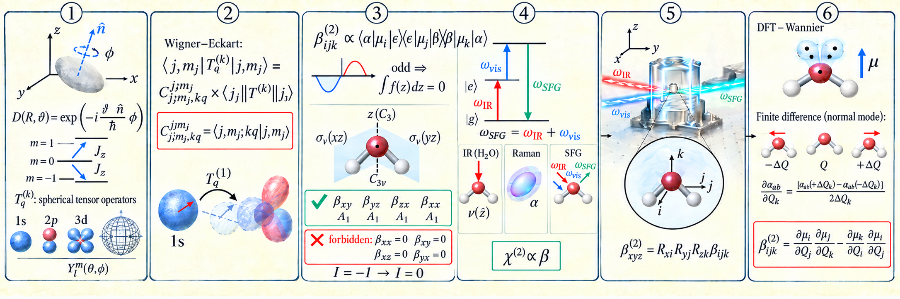

# From Sakurai's Quantum Mechanics to Hamm's SFG

## Overview

The route of this note can be reduced to one line.

We first build the mathematical language of angular momentum from the **generators of translation and rotation**. Then we introduce the **Wigner-Eckart theorem** and **molecular symmetry** to decide whether transition matrix elements and components of the second-order response tensor are zero.

After that, we follow the **time-dependent perturbation theory and density-matrix treatment** of Peter Hamm / Mukamel. This lets us write the second-order response of SFG as a product of dipole matrix elements.

Then we use $C_{2v}$ group theory to explain the IR/**Raman**/SFG selection rules of $H_2O$.

Finally, we rewrite the allowed $\beta_{ijk}$ components using derivatives of the dipole moment and polarizability with respect to normal-mode coordinates, and show how these quantities can be obtained using **DFT + finite differences**.

The last step is to project the molecular response from the molecular coordinate system into the laboratory coordinate system.

## Original Route

#### The rough path is this: first define the mathematical symbols for rotation and angular momentum, then introduce the **Wigner-Eckart theorem** and symmetry. We use them to decide whether the SFG second-order polarizability derived by Hamm is zero. For the nonzero components, we ask how to calculate them with DFT, and how to transform them from the molecular coordinate system to the laboratory coordinate system. At that point, we can basically explain where the SFG signal comes from.

The books used here include Sakurai's *Modern Quantum Mechanics*\[1\], the molecular-symmetry and group-theory part of Atkins' *Physical Chemistry*\[2\], and Peter Hamm's *Principles of Nonlinear Optical Spectroscopy: A Practical Approach, or: Mukamel for Dummies*\[3\].

The rotation of spherical tensors in SO(3)-equivariant neural networks is actually very similar to what we do here. **[SO(3) Neural Networks](SO(3)-Equivariant Graph Neural Networks_new.en.md)**

------------------------------------------------------------------------

## I. From Translation to Rotation: Angular Momentum as a Generator

### 1.1 Rotation generators and the SO(3) commutation relations

Let us first define some **annoying mathematics**, such as how to rotate something.

We need to introduce an infinitesimal rotation.

### 1.2 From the generator of translation to finite translation

To make this easier to accept, let us start with translation.

We can think of translation as an operation represented by an operator.

If we want to know what a very small translation looks like, we can simply do a Taylor expansion.

For $U(\epsilon)$ around $\epsilon=0$, the most general first-order form is

$$
U(\epsilon) \approx I + A\epsilon,
$$

where

$$
A = \left. \frac{\partial U}{\partial \epsilon} \right\vert{}_{\epsilon=0}.
$$

Quantum mechanics also requires total probability to remain unchanged before and after the transformation. Therefore, the transformation operator must be unitary:

$$
U^\dagger U=I.
$$

From this, we obtain

$$
U(\epsilon)=I-iG\epsilon.
$$

"Naturally," we use momentum to represent $G$.

The infinitesimal translation operator is then

$$
T(dx) = 1 - i \frac{p_x}{\hbar} dx
\tag{1}
$$

If we want to translate by a finite distance $a$, we can divide the operation into infinitely many small steps.

Each step moves by $a/N$, and we apply the operation $N$ times:

$$
T(a) = \lim_{N \to \infty} \left( 1 - i \frac{p_x}{\hbar} \frac{a}{N} \right)^N
\tag{2}
$$

Using the standard limit

$$
\lim_{N \to \infty}(1 + \frac{x}{N})^N = e^x,
$$

we immediately obtain the exponential form of the finite translation operator:

$$
T(a) = \exp\left(-i \frac{p_x a}{\hbar}\right)
\tag{3}
$$

We can use the same idea for rotation.

Momentum is the generator of translation, so **angular momentum** $\mathbf{J}$ is naturally the generator of rotation.

$$
D(\mathbf{\hat{n}}, \phi) = \left[ D\left(\mathbf{\hat{n}}, \frac{\phi}{N}\right) \right]^N
=
\lim_{N \to \infty}
\left[
1 - i \left(\frac{\mathbf{J} \cdot \mathbf{\hat{n}}}{\hbar}\right)\frac{\phi}{N}
\right]^N
$$

In continuous three-dimensional space, the physical meaning of the angular-momentum operator $\mathbf{J}$ is that it generates an infinitesimal rotation.

Once we put angular momentum inside an exponential, it becomes an actual rotation operator:

$$
D(\mathbf{\hat{n}}, \phi) = \exp\left(-i \frac{\mathbf{J} \cdot \mathbf{\hat{n}}}{\hbar} \phi\right)
\tag{4}
$$

You can think of it as a "rotation machine."

Give it a rotation axis $\mathbf{\hat{n}}$ and an angle $\phi$, and angular momentum $\mathbf{J}$ turns the system.

With this operator, we can rotate an object.

For example, suppose we follow the ZYZ Euler-angle convention. We first rotate around the $z$ axis by $45^\circ$, then around the $y$ axis by $5^\circ$, and finally around the $z$ axis again by $5^\circ$.

The product is

$$
D(\alpha, \beta, \gamma)
=
\exp\left(-i \frac{J_z}{\hbar} 5^\circ\right)
\exp\left(-i \frac{J_y}{\hbar} 5^\circ\right)
\exp\left(-i \frac{J_z}{\hbar} 45^\circ\right)
\tag{5}
$$

Remember that quantum-mechanical operators act from right to left, so the first operation must appear on the far right.

You may ask: why not use an XYZ convention?

XYZ rotations can also describe a general three-dimensional rotation. We use ZYZ here simply because it is a common Euler-angle convention.

Any three-parameter Euler-angle representation can have coordinate singularities at some configurations, sometimes called gimbal lock. This is a problem of the parameterization, not a problem with the real continuous physical space.

**As for SO(3), it is just a mathematical group notation. You can imagine that when we move a water bottle around — tilt it up, turn it left — we are doing an SO(3) process. SU(2) is the group used to describe rotations of spin quantum states. Electron spin $1/2$ is one of its basic representations. It looks a little strange compared with ordinary three-dimensional vectors: a spin-$1/2$ state rotated by** $360^\circ$ **does not return exactly to itself; it picks up a minus sign. Do not worry about that for now. It is just a symbol. Feynman said that if you only know the name or symbol of something, you do not really understand it. So do not be afraid of the notation.** \[1\]

Rotations about different directions in three-dimensional space do not commute.

This is easy to imagine.

Turn a water bottle upside down first and then rotate the label to the back. If you reverse those two operations, you will not end up in the same state.

This noncommuting behavior directly determines the algebra of the microscopic operators.

The central commutation relation of SO(3) is\[1\]:

$$
[J_i,J_j]=i\hbar\epsilon_{ijk}J_k.
$$

This is basically the mathematical version of saying that "rotations do not commute."

We need this formula mainly because it makes the calculations below easier.

## II. A "Good Basis" for Angular Momentum and Its Algebra

### 2.1 Finding a "good basis" and the total angular momentum operator $J^2$

- We always like to describe physics in a good basis, just as we describe a position using XYZ coordinates. To fully describe the state of the system, we introduce the total angular-momentum operator

$$
J^2=J_x^2+J_y^2+J_z^2.
$$

- As a scalar operator, $J^2$ is unchanged by an overall rotation. Therefore, it commutes with the angular-momentum projection along any one direction:

$$
[J^2,J_z]=0.
$$

- According to quantum mechanics, commuting operators can share eigenstates. We choose the common eigenstates $\vert{}j,m\rangle$ of $J^2$ and $J_z$ as the complete "good basis" for describing angular momentum. In other words, because these two operators commute, $j$ and $m$ can be used together as a complete set of quantum numbers for the angular-momentum state of a molecule.

### 2.2 Ladder operators: algebraic adding and subtracting

- Here I follow Sakurai. I will not go into too much detail. To avoid solving complicated Schrödinger differential equations directly, we introduce the elegant ladder operators

$$
J_{\pm}=J_x\pm iJ_y.
$$

- Using the commutation relation

$$
[J_z,J_\pm]=\pm\hbar J_\pm,
$$

we can show purely by algebra that $J_+$ raises the $z$-projection by one $\hbar$, while $J_-$ lowers it by one $\hbar$.

- Together with the physical boundary condition that a projection cannot be larger than the total vector length,

$$
J^2-J_z^2\ge0,
$$

the ladder must stop at both ends. This gives the quantization rules for $j$ and $m$ without solving the differential equation directly. From this, we also get the allowed ranges of $j$ and $m$.

### 2.3 Eigenvalue spectrum and isotropy

- For $J^2$, the total angular momentum, the eigenvalue is $j(j+1)\hbar^2$:

$$
J^2 \vert{}j, m\rangle = j(j+1)\hbar^2 \vert{}j, m\rangle
\tag{6}
$$

- For $J_z$, the eigenvalue is $m\hbar$. Here, $m$ is the magnetic quantum number and satisfies

$$
-j\le m\le j.
$$

- We can write

$$
J_z\vert{}j,m\rangle=m\hbar\vert{}j,m\rangle.
$$

- $J_x$ and $J_y$ must be physically equivalent to $J_z$ because three-dimensional space is isotropic. The $z$ axis is only a direction chosen by us. Therefore, $J_x$ and $J_y$ have the same type of eigenvalue spectrum as $J_z$, even though their eigenstates are complicated linear combinations of the $\vert{}j,m\rangle$ basis.

- At this point, the basic coordinate system and angular-momentum relations in spherical coordinates are essentially in place.

### 2.4 Deriving the Wigner-Eckart theorem

I will skip the derivation of the Wigner-Eckart theorem here.

You can read Sakurai directly.\[1\]

It is extremely beautiful.

Every time I read the derivation, I forget it again.

But Wigner bringing group theory into quantum mechanics also confused many physicists at first. A lot of people did not know what Wigner was doing.

So if we cannot understand it immediately, that does not mean we are stupid.

## III. Irreducible Spherical Tensors and the Wigner-Eckart Theorem

### 3.1 Irreducible spherical tensor operators: throw Cartesian coordinates into the trash

- When we calculate a polarizability or hyperpolarizability such as $\beta$, the optical electric field is often written in laboratory Cartesian coordinates $x,y,z$, for example using dipole operators $\mu_x,\mu_y,\mu_z$.

- But Cartesian coordinates are very clumsy for rotations. A photon interacting with a molecule is fundamentally transferring angular momentum. So we want a mathematical language that speaks directly in terms of $(j,m)$. That language is the **irreducible spherical tensor operator** $T_q^{(k)}$.

- **The simple form**: for the dipole transitions that we care about, meaning absorption or emission of one photon, the tensor rank is $k=1$. The three components $q\in\{-1,0,1\}$ match the angular-momentum projection carried by the photon. We can translate Cartesian components into spherical-tensor components:

  - $z=T_0^{(1)}$  
    This corresponds to $q=0$ and does not change the molecular $z$-projection of angular momentum.

  - $x=\frac{1}{\sqrt{2}}\left(T_{-1}^{(1)}-T_1^{(1)}\right)$  
    This combines the $q=\pm1$ components.

  - $y=\frac{i}{\sqrt{2}}\left(T_{-1}^{(1)}+T_1^{(1)}\right)$  
    This also combines the $q=\pm1$ components, but with an imaginary phase.

- **Physical meaning**: it is basically another way to write XYZ.

### 3.2 The Wigner-Eckart theorem: geometry × strength

- One of the most annoying parts of quantum mechanics is calculating integrals. You can build beautiful wavefunctions and states, but without a measurement — without the bra-ket matrix element — you still cannot connect them to the real world. You need to project the quantum state onto something measurable.

The Wigner-Eckart theorem helps us calculate transition matrix elements\[1\]:

$$
\langle j_f, m_f \vert T_q^{(k)} \vert j_i, m_i \rangle.
$$

If you calculate this directly, then every time you rotate the molecule or change the light polarization, you may need another three-dimensional integral.

- The Wigner-Eckart theorem says: stop doing that.

The matrix element can be split into two parts:

$$
\langle j_f, m_f \vert T_q^{(k)} \vert j_i, m_i \rangle
=
\langle j_i, k; m_i, q \vert j_f, m_f \rangle
\frac{\langle j_f \vert\vert T^{(k)} \vert\vert j_i \rangle}
{\sqrt{2j_f+1}}
\tag{7}
$$

- **The first term on the right, the CG coefficient**: this is the external geometric part. It only cares about rotational symmetry in three-dimensional space, or angular-momentum conservation. It does not matter whether you are working with water or some complicated coordination complex. If the angular-momentum quantum numbers do not match, this term is simply zero. You do not need to calculate an integral. You can look up the coefficient.

- More specifically, in $C(j_1,m_1;k,q\vert j_2,m_2)$, the geometric picture is this:

**The external-field operator** $(k,q)$ acts on the initial state $(j_1,m_1)$ through a tensor product, and then the resulting object is projected onto the final state $(j_2,m_2)$.

- **The second term on the right, the reduced matrix element**, the one with double vertical bars: this is the internal physics. It contains the radial integrals of the molecular wavefunctions and the oscillator strength of the internal structure.

Notice something important.

It contains neither $m$ nor $q$.

That means it **does not care how the molecule is oriented in space or from which direction the photon arrives**.

### 3.3 What does the Wigner-Eckart theorem actually solve for us?

- **It lets us be lazy**: in macroscopic nonlinear-optical calculations, without the Wigner-Eckart theorem, expanding something like $\beta_{zxy}$ into all its integral paths would be a computational nightmare.

- **It gives selection rules directly**: the theorem turns the question of whether a complicated matrix element survives into a question about CG coefficients. If the CG coefficient is zero, the transition is forbidden. When we later discuss why a molecular component such as $\beta_{zxy}$ can vanish, we are mostly playing with combinations and cancellations of CG coefficients. We do not need to know every detail of the internal electron cloud.

- **It separates variables and lets us pull out constants**: when deriving SFG/SHS, the internal molecular dynamics, represented by the reduced matrix element, can be treated as an unknown but fixed constant. Then we can focus on spatial angles, photon polarization, and coordinate projections.

When I was a graduate student, I secretly sat in on an undergraduate quantum-mechanics course.

The professor once told a story.

When he was a student, he asked his own professor, "What is the Fourier transform useful for?"

His professor answered, "Do not worry about it. Just learn how to calculate it."

Then history repeated itself.

I asked him, "What is group theory useful for?"

He told me, "It lets you calculate much less."

He tried to explain further, but he could see that I still did not understand, so we stopped the conversation.

I remember it was winter.

I never really learned group theory at that time, and I did not use it either. But I remembered that sentence for a long time.

I believe these apparently useless things can be very beautiful.

And now the role of group theory and the Wigner-Eckart theorem finally appears here.

## IV. From Time-Dependent Perturbation Theory to the Second-Order SFG Response

Because we care about the quantum-mechanical basis of nonlinear optical **SFG / SHS**, the time-dependent perturbation and density-matrix treatment from Peter Hamm and Mukamel gives a strict analytical connection between the external optical field and the microscopic molecular dipole transition matrix elements.\[3\]\[4\]

### 4.1 Step 1: nested commutators in Liouville space

This part is actually straightforward if you follow Hamm's book.

Starting from the density matrix of a two-level system and using time-dependent perturbation theory, you can obtain the following equation.

The second-order density matrix in the **interaction picture** is given by a double time integral from the Liouville-von Neumann equation:

$$
\rho^{(2)}(t) = \left(\frac{-i}{\hbar}\right)^2
\int_{-\infty}^{t} dt_2
\int_{-\infty}^{t_2} dt_1
\left[
\tilde{V}(t_2),
\left[
\tilde{V}(t_1),
\rho^{(0)}
\right]
\right]
\tag{8}
$$

Assume that the system starts completely in the ground state:

$$
\rho^{(0)}=\vert{}a\rangle\langle a\vert{}.
$$

Expanding the inner commutator and then the outer commutator gives four terms:

$$
\left[ \tilde{V}(t_2), \left[ \tilde{V}(t_1), \rho^{(0)} \right] \right]
=
\tilde{V}(t_2)\tilde{V}(t_1)\rho^{(0)}
-
\tilde{V}(t_2)\rho^{(0)}\tilde{V}(t_1)
-
\tilde{V}(t_1)\rho^{(0)}\tilde{V}(t_2)
+
\rho^{(0)}\tilde{V}(t_1)\tilde{V}(t_2)
\tag{9}
$$

To show one contribution path in SFG where the system absorbs two photons one after another, we can choose the pure ket-side excitation path in the double-sided Feynman diagram:

$$
\vert{}a\rangle
\xrightarrow{\omega_1}
\vert{}b\rangle
\xrightarrow{\omega_2}
\vert{}c\rangle.
$$

This corresponds to the first term, where both interaction operators act on the left side of the density matrix:

$$
\tilde{V}(t_2)\tilde{V}(t_1)\rho^{(0)}.
$$

The complete second-order response also requires the other allowed Liouville pathways and time orderings.\[3\]\[4\]

For SFG, the system absorbs two photons and evolves to

$$
\vert{}c\rangle\langle a\vert{}.
$$

To complete the SFG emission process, the system must emit a photon with frequency $\omega_1+\omega_2$ and return from the highest excited state $\vert{}c\rangle$ to the ground state $\vert{}a\rangle$.

So we extract the off-diagonal density-matrix element that reaches $\vert{}c\rangle$:

$$
\rho_{ca}^{(2)}(t)
=
\langle c\vert{}\rho^{(2)}(t)\vert{}a\rangle
$$

which gives

$$
\rho_{ca}^{(2)}(t) = \left(\frac{-i}{\hbar}\right)^2
\int_{-\infty}^{t} dt_2
\int_{-\infty}^{t_2} dt_1
\langle c \vert{} \tilde{V}(t_2)\tilde{V}(t_1) \vert{} a \rangle
\langle a \vert{} a \rangle
\tag{10}
$$

### 4.2 Step 2: interaction Hamiltonian and time-evolution integrals

Insert a complete set of energy eigenstates

$$
I=\sum_b\vert{}b\rangle\langle b\vert{}
$$

between $\tilde{V}(t_2)$ and $\tilde{V}(t_1)$.

Since

$$
\langle a\vert{}a\rangle=1,
$$

we get

$$
\langle c \vert{} \tilde{V}(t_2)\tilde{V}(t_1) \vert{} a \rangle
=
\sum_b
\langle c \vert{} \tilde{V}(t_2) \vert{} b \rangle
\langle b \vert{} \tilde{V}(t_1) \vert{} a \rangle
\tag{11}
$$

In the interaction picture, the operator carries the time-evolution phase from the unperturbed Hamiltonian $H_0$:

$$
\tilde{V}(t)
=
e^{iH_0t/\hbar}
(-\mu\cdot E(t))
e^{-iH_0t/\hbar}.
$$

Therefore,

$$
\langle n \vert{} \tilde{V}(t) \vert{} m \rangle
=
-\mu_{nm}e^{i\omega_{nm}t}E(t)
\tag{12}
$$

where

$$
\omega_{nm}=(E_n-E_m)/\hbar
$$

is the Bohr frequency.

Assume the incident fields are

$$
E(t_1)=E(\omega_1)e^{-i\omega_1t_1}
$$

and

$$
E(t_2)=E(\omega_2)e^{-i\omega_2t_2}.
$$

Then

$$
\langle b \vert{} \tilde{V}(t_1) \vert{} a \rangle
=
-\mu_{ba} E(\omega_1)e^{i(\omega_{ba}-\omega_1)t_1}
\tag{13}
$$

and

$$
\langle c \vert{} \tilde{V}(t_2) \vert{} b \rangle
=
-\mu_{cb} E(\omega_2)e^{i(\omega_{cb}-\omega_2)t_2}
\tag{14}
$$

First integrate over $t_1$.

To make the integral from $-\infty$ physically convergent, introduce a coherence dephasing rate $+i\Gamma_{ba}$:

$$
I_1
=
\int_{-\infty}^{t_2}
dt_1
e^{i(\omega_{ba}-\omega_1-i\Gamma_{ba})t_1}
=
\frac{
e^{i(\omega_{ba}-\omega_1-i\Gamma_{ba})t_2}
}{
i(\omega_{ba}-\omega_1-i\Gamma_{ba})
}
\tag{15}
$$

Substitute $I_1$ into the $t_2$ integral.

Introduce the overall dephasing rate $+i\Gamma_{ca}$ and combine the exponents:

$$
i(\omega_{cb}+\omega_{ba}\dots)
=
i(\omega_{ca}\dots).
$$

Then

$$
I_2
=
\int_{-\infty}^{t}
dt_2
e^{i(\omega_{cb}-\omega_2)t_2}
\cdot
\frac{
e^{i(\omega_{ba}-\omega_1-i\Gamma_{ba})t_2}
}{
i(\omega_{ba}-\omega_1-i\Gamma_{ba})
}
=
\frac{
e^{i(\omega_{ca}-\omega_1-\omega_2-i\Gamma_{ca})t}
}{
i^2
(\omega_{ca}-\omega_1-\omega_2-i\Gamma_{ca})
(\omega_{ba}-\omega_1-i\Gamma_{ba})
}
\tag{16}
$$

Combining all constants, including the earlier factor $(-i/\hbar)^2$ and the two minus signs from the dipole interactions, the $i^2$ factors cancel.

We obtain the frequency-domain second-order density-matrix amplitude:

$$
\rho_{ca}^{(2)}(\omega_1 + \omega_2)
\propto
\sum_b
\frac{
\mu_{cb} E(\omega_2)
\mu_{ba} E(\omega_1)
}{
(\omega_{ca} - \omega_1 - \omega_2 - i\Gamma_{ca})
(\omega_{ba} - \omega_1 - i\Gamma_{ba})
}
\rho_{aa}^{(0)}
\tag{17}
$$

### 4.3 Step 3: the Trace operation and closing the polarization loop

The second-order molecular dipole response $p^{(2)}$ is the quantum-mechanical expectation value of the dipole operator.

It is obtained using a **Trace** operation.

Only after multiplying by molecular number density and carrying out the orientational average do we obtain the macroscopic second-order polarization $P^{(2)}$ measured in an experiment.\[4\]\[5\]

$$
p^{(2)}(t)
=
\text{Tr}\left(\mu\rho^{(2)}(t)\right)
=
\sum_n
\langle n\vert{}\mu\rho^{(2)}(t)\vert{}n\rangle
\tag{18}
$$

Insert another complete basis between $\mu$ and $\rho^{(2)}$:

$$
\sum_m\vert{}m\rangle\langle m\vert{}.
$$

Then

$$
p^{(2)}
=
\sum_{n,m}
\langle n \vert{} \mu \vert{} m \rangle
\langle m \vert{} \rho^{(2)} \vert{} n \rangle
\tag{19}
$$

Our SFG pathway ends at $\vert{}c\rangle$.

To close the loop and emit a photon back to the initial state, we choose

$$
m=c,\qquad n=a.
$$

Then

$$
p^{(2)}(\omega_1+\omega_2)
=
\sum_c
\langle a\vert{}\mu\vert{}c\rangle
\rho_{ca}^{(2)}(\omega_1+\omega_2)
\tag{20}
$$

Now we need to connect this to the polarization directions used in the experiment.

Project the dipole operator onto the Cartesian axes.

Let the $\omega_1$ excitation field have polarization $k$, the $\omega_2$ excitation field have polarization $j$, and the emitted signal have polarization $i$:

$$
p_i^{(2)}
=
\sum_c
\langle a \vert{} \mu_i \vert{} c \rangle
\left[
\rho_{ca}^{(2)}
\text{ with the corresponding terms replaced by }
\mu_k
\text{ and }
\mu_j
\right]
\tag{21}
$$

### 4.4 Step 4: extracting the microscopic hyperpolarizability and the dipole-product structure

Substitute the Cartesian-index form of $\rho_{ca}^{(2)}$ into the Trace expression.

Then pull the macroscopic optical fields $E_j$ and $E_k$ outside the internal molecular-state sum:

$$
p_i^{(2)}
=
\left[
\sum_{b,c}
\frac{
\langle a \vert{} \mu_i \vert{} c \rangle
\langle c \vert{} \mu_j \vert{} b \rangle
\langle b \vert{} \mu_k \vert{} a \rangle
}{
(\omega_{ca} - \omega_1 - \omega_2 - i\Gamma_{ca})
(\omega_{ba} - \omega_1 - i\Gamma_{ba})
}
\rho_{aa}^{(0)}
\right]
E_j(\omega_2)E_k(\omega_1)
\tag{22}
$$

From the definition of the second-order dipole response of one molecule,

$$
p_i^{(2)}
=
\sum_{j,k}
\beta_{ijk}E_jE_k,
$$

we can directly identify the contribution of this Liouville pathway to the microscopic hyperpolarizability tensor $\beta_{ijk}$.

For a macroscopic medium, one usually writes

$$
P_i^{(2)}
=
\varepsilon_0
\sum_{j,k}
\chi_{ijk}^{(2)}E_jE_k,
$$

where $\chi^{(2)}$ is related to molecular number density and the orientational average of $\beta$.\[5\]

Therefore,

$$
\beta_{ijk}
\propto
\sum_{b,c}
\frac{
\langle a \vert{} \mu_i \vert{} c \rangle
\langle c \vert{} \mu_j \vert{} b \rangle
\langle b \vert{} \mu_k \vert{} a \rangle
}{
(\omega_{ca} - \omega_1 - \omega_2 - i\Gamma_{ca})
(\omega_{ba} - \omega_1 - i\Gamma_{ba})
}
\rho_{aa}^{(0)}
\tag{23}
$$

Now we can use the Wigner-Eckart theorem, group theory, symmetry, odd/even parity, or any other trick we can think of to avoid unnecessary calculations and check whether some $\beta_{ijk}$ components are exactly zero.

## V. $C_{2v}$ Symmetry of $H_2O$ and Selection Rules

### 5.1 Why do $(A_1,A_2,B_1,B_2)$ appear for $H_2O$?

Let us first look at some simple group theory.

Put one water molecule on the table.

Choose the coordinate system so that

$$
z=\text{the bisector of the HOH angle, which is also the }C_2\text{ axis}
\tag{24}
$$

and place the water molecule in the $(yz)$ plane.

This water molecule has four operations that leave it unchanged:

$$
E
\tag{25}
$$

Do nothing.

$$
C_2(z)
\tag{26}
$$

Rotate by $180^\circ$ around the $z$ axis. The two H atoms exchange positions.

$$
\sigma_v(xz)
\tag{27}
$$

Reflect through the $(xz)$ plane. The two H atoms exchange positions.

$$
\sigma_v'(yz)
\tag{28}
$$

Reflect through the molecular $(yz)$ plane.

These four operations form the $C_2(z)$ group.

Atkins explains this part very clearly.\[6\]

The standard $C_2(z)$ character table is

|      | E   | $C_2(z)$ | $\sigma_v(xz)$ | $\sigma_v'(yz)$ | Common basis functions |
| ---- | ---:| --------:| --------------:| ---------------:| --------------------------- |
| A1\\ | 1   | 1        | 1              | 1               | (z,x$^{2}$,y$^{2}$,z$^{2}$) |
| A2\\ | 1   | 1        | -1             | -1              | (Rz,xy)                     |
| B1\\ | 1   | -1       | 1              | -1              | (x,Ry,xz)                   |
| B2\\ | 1   | -1       | -1             | 1               | (y,Rx,yz)                   |

The "common basis functions" tell us which functions transform according to each symmetry species.

For example, $z$ belongs to $A_1$.

The identity operation $E$ leaves every function unchanged, so the character under $E$ is always 1.

### 5.2 The three normal vibrations of water

Spectroscopy is basically observing molecular vibrations.

A nonlinear vibration can change the molecular dipole moment.

For a nonlinear molecule, the number of vibrational degrees of freedom is

$$
3N-6.
$$

For water, after removing translation and rotation, three normal modes remain:

$$
\boxed{ \nu_1(A_1):\text{symmetric stretch} } \qquad
\boxed{ \nu_2(A_1):\text{HOH bend} }
\tag{29}
$$

$$
\boxed{ \nu_3(B_2):\text{antisymmetric stretch} }
\tag{30}
$$

These three normal modes form a useful basis.

More complicated molecular motion can be decomposed into combinations of these modes, and spectral motion can also be discussed in terms of them.

### 5.3 IR selection rules: vibrational symmetry and dipole components

Now return to the product of dipole matrix elements in the second-order hyperpolarizability:

$$
\beta_{ijk} \propto
\sum_{b,c}
\frac{
\langle a \vert \mu_i \vert c \rangle
\langle c \vert \mu_j \vert b \rangle
\langle b \vert \mu_k \vert a \rangle
}{
(\omega_{ca}-\omega_1-\omega_2-i\Gamma_{ca})
(\omega_{ba}-\omega_1-i\Gamma_{ba})
}
\rho_{aa}^{(0)}
\tag{31}
$$

Assume the vibrational ground state is

$$
|0\rangle.
\tag{32}
$$

The ground state is totally symmetric:

$$
\Gamma(|0\rangle)=A_1.
\tag{33}
$$

For a one-quantum excitation of normal mode $q$,

$$
|1_q\rangle,
\tag{34}
$$

the symmetry is the symmetry of that normal mode:

$$
\Gamma(|1_q\rangle)=\Gamma(Q_q).
\tag{35}
$$

The IR transition matrix element is

$$
\langle1_q|\mu_i|0\rangle.
\tag{36}
$$

For it to be nonzero, we require

$$
\Gamma(Q_q)\otimes\Gamma(\mu_i)\otimes A_1
\supset A_1.
\tag{37}
$$

Multiplying by $A_1$ changes nothing, so

$$
\boxed{ \Gamma(Q_q)=\Gamma(\mu_i). }
\tag{38}
$$

This is the real meaning of looking up the character table in Atkins.

Because

$$
\mu_x\sim B_1,\qquad
\mu_y\sim B_2,\qquad
\mu_z\sim A_1,
\tag{39}
$$

any vibration with symmetry

$$
A_1,\ B_1,\ B_2
\tag{40}
$$

can in principle be **IR active**.

Looking back at the product of dipole matrix elements, this means the rightmost factor

$$
\langle b|\mu_k|a\rangle
$$

can be nonzero.

A Raman transition uses a matrix element such as

$$
\langle1_q|\alpha_{ij}|0\rangle,
$$

and the same symmetry idea applies.

### 5.4 Symmetry test for the second-order hyperpolarizability tensor

Now return to the main question.

Can a molecular tensor component $\beta_{ijk}$ exist?

From Eq. (23),

$$
\beta_{ijk}
\sim
\sum_{b,c}
\langle a|\mu_i|c\rangle
\langle c|\mu_j|b\rangle
\langle b|\mu_k|a\rangle
\tag{41}
$$

Assume that the initial and final states are both the same totally symmetric $A_1$ ground state.

Then the product of the three dipole operators must contain the totally symmetric representation:

$$
\Gamma(\mu_i)
\otimes
\Gamma(\mu_j)
\otimes
\Gamma(\mu_k)
\supset A_1.
\tag{42}
$$

The reason is simple.

If the entire integrand changes sign under a symmetry operation, then the integral obeys

$$
I=-I.
$$

Therefore,

$$
I=0.
$$

So we can directly use

$$
\mu_x\sim B_1,\quad
\mu_y\sim B_2,\quad
\mu_z\sim A_1
\tag{43}
$$

to test each tensor component.

For example,

$$
\beta_{zxx}
=
\mu_z\mu_x\mu_x
=
A_1\otimes B_1\otimes B_1
$$

Since

$$
B_1\otimes B_1=A_1,
$$

we get

$$
A_1\otimes A_1=A_1
\tag{48}
$$

Therefore,

$$
\boxed{\beta_{zxx}\neq0\text{ is allowed by symmetry}.}
\tag{49}
$$

But

$$
\beta_{xxx}
\tag{50}
$$

corresponds to

$$
B_1\otimes B_1\otimes B_1=B_1
\tag{51}
$$

which is not $A_1$.

Therefore,

$$
\beta_{xxx}=0
\tag{52}
$$

We can also use parity:

**even × odd = odd, and even × even = even.**

The ground state is usually symmetric and even.

The dipole operator is odd.

Then the question becomes what symmetry the remaining state has.

Again, it is the same idea: the integral of an odd function over a symmetric domain is zero, while an even contribution can survive.

## VI. Why Vibrational SFG Requires Both IR and Raman Activity

We can make the rule even simpler.

In the electric-dipole approximation, a vibrational SFG mode must be both Raman active and IR active.\[6\]

Why?

Because the expression for $\beta_{ijk,q}^{(2)}$ can be rewritten from a product of dipole matrix elements into

$$
\left(\frac{\partial\alpha_{ij}}{\partial Q_q}\right)
\left(\frac{\partial\mu_k}{\partial Q_q}\right).
$$

The derivation is below.

$$
|g,0\rangle
\xrightarrow{\mu_k,\omega_{\mathrm{IR}}}
|g,1_q\rangle
\xrightarrow{\mu_j,\omega_{\mathrm{vis}}}
|e,\nu\rangle
\xrightarrow{\mu_i,\omega_{\mathrm{SFG}}}
|g,0\rangle.
\tag{53}
$$

### 6.1 Step 1: the vibrational resonance denominator becomes $(\omega_q-\omega_{\rm IR})$

Look again at

$$
\beta_{ijk} \propto
\sum_{b,c}
\frac{
\langle a \vert \mu_i \vert c \rangle
\langle c \vert \mu_j \vert b \rangle
\langle b \vert \mu_k \vert a \rangle
}{
(\omega_{ca}-\omega_1-\omega_2-i\Gamma_{ca})
(\omega_{ba}-\omega_1-i\Gamma_{ba})
}
\rho_{aa}^{(0)}
\tag{31}
$$

Because

$$
|a\rangle=|g,0\rangle, \qquad
|b\rangle=|g,1_q\rangle,
\tag{54}
$$

we have

$$
\omega_{ba}=\omega_q.
\tag{55}
$$

Therefore, the second denominator

$$
\omega_{ba}-\omega_{\mathrm{IR}}-i\Gamma_{ba}
\tag{56}
$$

becomes

$$
\boxed{
\omega_q-\omega_{\mathrm{IR}}-i\Gamma_q
}.
\tag{57}
$$

So

$$
\beta_{ijk,q}
\propto
\frac{1}{
\omega_q-\omega_{\mathrm{IR}}-i\Gamma_q
}
\sum_c
\frac{
\langle g,0|\mu_i|c\rangle
\langle c|\mu_j|g,1_q\rangle
\langle g,1_q|\mu_k|g,0\rangle
}{
\omega_{ca}-\omega_{\mathrm{SFG}}-i\Gamma_c
}
\tag{58}
$$

Pull out the last matrix element:

$$
\beta_{ijk,q}
\propto
\frac{
\langle g,1_q|\mu_k|g,0\rangle
}{
\omega_q-\omega_{\mathrm{IR}}-i\Gamma_q
}
\left[
\sum_c
\frac{
\langle g,0|\mu_i|c\rangle
\langle c|\mu_j|g,1_q\rangle
}{
\omega_{ca}-\omega_{\mathrm{SFG}}-i\Gamma_c
}
\right]
\tag{59}
$$

Now the two pieces are very clear.

### 6.2 Step 2: the isolated dipole matrix element becomes $(\partial\mu/\partial Q_q)$

Look at

$$
\langle g,1_q|\mu_k|g,0\rangle.
\tag{60}
$$

Under the **Born-Oppenheimer approximation**, the electronic state remains $g$, so we can treat this as a vibrational matrix element:

$$
\langle1_q|\mu_k(Q)|0\rangle.
\tag{61}
$$

Now comes the key step.

Treat the molecular dipole moment as a function of the nuclear coordinates:

$$
\mu_k=\mu_k(Q_1,Q_2,\ldots).
\tag{62}
$$

Taylor-expand it around the equilibrium structure $Q=0$:

$$
\mu_k(Q)
=
\mu_k^{(0)}
+
\sum_r
\left(
\frac{\partial\mu_k}{\partial Q_r}
\right)_0
Q_r
+\cdots
\tag{63}
$$

For the normal mode $q$,

$$
\mu_k(Q)
\simeq
\mu_k^{(0)}
+
\left(
\frac{\partial\mu_k}{\partial Q_q}
\right)_0
Q_q.
\tag{64}
$$

Substitute this into the matrix element:

$$
\langle1_q|\mu_k|0\rangle
=
\mu_k^{(0)}
\langle1_q|0\rangle
+
\left(
\frac{\partial\mu_k}{\partial Q_q}
\right)_0
\langle1_q|Q_q|0\rangle.
\tag{65}
$$

Because vibrational eigenstates are orthogonal,

$$
\langle1_q|0\rangle=0,
\tag{66}
$$

the constant term disappears.

What remains is

$$
\boxed{
\langle1_q|\mu_k|0\rangle
=
\left(
\frac{\partial\mu_k}{\partial Q_q}
\right)_0
\langle1_q|Q_q|0\rangle
}.
\tag{67}
$$

Therefore,

$$
\boxed{
\langle b|\mu_k|a\rangle
\longrightarrow
\frac{\partial\mu_k}{\partial Q_q}
}.
\tag{68}
$$

This is the IR part.

So the real quantum-mechanical meaning of "IR active" is

$$
\boxed{
\frac{\partial\mu_k}{\partial Q_q}\neq0
}.
\tag{69}
$$

### 6.3 Step 3: the product of two electronic dipoles becomes $\alpha_{ij}$

Now look at the term in brackets:

$$
\sum_c
\frac{
\langle g,0|\mu_i|c\rangle
\langle c|\mu_j|g,1_q\rangle
}{
\omega_{ca}-\omega_{\mathrm{SFG}}-i\Gamma_c
}.
\tag{70}
$$

This structure should already look familiar:

$$
\boxed{
\sum_{\mathrm{electronic\ states}}
\frac{\mu_i\mu_j}{\text{electronic energy denominator}}
}
\tag{71}
$$

It is exactly the sum-over-states structure of the polarizability $\alpha_{ij}$.

For example, the linear polarizability has a Kramers-Heisenberg-like form:

$$
\alpha_{ij}
\sim
\sum_e
\frac{
\langle g|\mu_i|e\rangle
\langle e|\mu_j|g\rangle
}{
\omega_{eg}-\omega
}
+\text{other time orderings}.
\tag{72}
$$

So we can define an effective frequency-dependent electronic polarizability operator:

$$
\hat\alpha_{ij}
(Q;\omega_{\mathrm{vis}},\omega_{\mathrm{SFG}}),
\tag{73}
$$

such that

$$
\boxed{
\langle0|\hat\alpha_{ij}(Q)|1_q\rangle
\equiv
\sum_c
\frac{
\langle g,0|\mu_i|c\rangle
\langle c|\mu_j|g,1_q\rangle
}{
D_c
}
+\text{permutations}
}.
\tag{74}
$$

So the original three dipoles,

$$
\mu_i\mu_j\mu_k,
\tag{75}
$$

have now been compressed into

$$
\boxed{
\alpha_{ij}\mu_k
}.
\tag{76}
$$

This point is worth emphasizing:

$$
\boxed{
\mu_i\mu_j
\quad\stackrel{\sum_c}{\longrightarrow}\quad
\alpha_{ij}
}
\tag{77}
$$

does **not** mean that

$$
\alpha_{ij}=\mu_i\mu_j.
\tag{78}
$$

Instead,

$$
\boxed{
\alpha_{ij}
=
\text{two dipole matrix elements}
+
\text{sum over all virtual electronic states}
+
\text{electronic energy denominators}
}
\tag{79}
$$

all packed into one quantity.

That is why a DFT response calculation can give us $\alpha$ directly without explicitly listing every electronic state $c$.

### 6.4 Step 4: $\langle0|\alpha_{ij}|1_q\rangle$ becomes $\partial\alpha_{ij}/\partial Q_q$

Now we do exactly the same thing as we did for the dipole moment.

The polarizability also depends on nuclear coordinates:

$$
\alpha_{ij}
=
\alpha_{ij}(Q_1,Q_2,\ldots).
\tag{80}
$$

Expand around equilibrium:

$$
\alpha_{ij}(Q)
=
\alpha_{ij}^{(0)}
+
\sum_r
\left(
\frac{\partial\alpha_{ij}}{\partial Q_r}
\right)_0
Q_r
+\cdots
\tag{81}
$$

For mode $q$,

$$
\alpha_{ij}(Q)
\simeq
\alpha_{ij}^{(0)}
+
\left(
\frac{\partial\alpha_{ij}}{\partial Q_q}
\right)_0
Q_q.
\tag{82}
$$

Therefore,

$$
\langle0|\alpha_{ij}|1_q\rangle
=
\alpha_{ij}^{(0)}
\langle0|1_q\rangle
+
\left(
\frac{\partial\alpha_{ij}}{\partial Q_q}
\right)_0
\langle0|Q_q|1_q\rangle.
\tag{83}
$$

Again,

$$
\langle0|1_q\rangle=0,
\tag{84}
$$

so

$$
\boxed{
\langle0|\alpha_{ij}|1_q\rangle
=
\left(
\frac{\partial\alpha_{ij}}{\partial Q_q}
\right)_0
\langle0|Q_q|1_q\rangle
}.
\tag{85}
$$

Therefore,

$$
\boxed{
\sum_c
\frac{
\langle a|\mu_i|c\rangle
\langle c|\mu_j|b\rangle
}{
D_c
}
\longrightarrow
\frac{\partial\alpha_{ij}}{\partial Q_q}
}.
\tag{86}
$$

This is the Raman part.

### 6.5 Step 5: multiply the two sides back together

We now have

$$
\langle1_q|\mu_k|0\rangle
=
\mu'_{k,q}
\langle1_q|Q_q|0\rangle,
\tag{87}
$$

and

$$
\langle0|\alpha_{ij}|1_q\rangle
=
\alpha'_{ij,q}
\langle0|Q_q|1_q\rangle,
\tag{88}
$$

where, to save space,

$$
\mu'_{k,q}
\equiv
\left(
\frac{\partial\mu_k}{\partial Q_q}
\right)_0,
\qquad
\alpha'_{ij,q}
\equiv
\left(
\frac{\partial\alpha_{ij}}{\partial Q_q}
\right)_0.
\tag{89}
$$

Multiplying them gives

$$
\langle0|\alpha_{ij}|1_q\rangle
\langle1_q|\mu_k|0\rangle
=
\alpha'_{ij,q}
\mu'_{k,q}
\left|
\langle0|Q_q|1_q\rangle
\right|^2.
\tag{90}
$$

Therefore,

$$
\boxed{
\beta^{(2)}_{ijk,q}
\propto
\frac{
\alpha'_{ij,q}
\mu'_{k,q}
\left|
\langle0|Q_q|1_q\rangle
\right|^2
}{
\omega_q-\omega_{\mathrm{IR}}-i\Gamma_q
}
}.
\tag{91}
$$

If $Q_q$ is a mass-weighted harmonic normal coordinate,

$$
\langle0|Q_q|1_q\rangle
=
\sqrt{\frac{\hbar}{2\omega_q}}.
\tag{92}
$$

Therefore,

$$
\left|
\langle0|Q_q|1_q\rangle
\right|^2
=
\frac{\hbar}{2\omega_q}.
\tag{93}
$$

So a more complete expression is

$$
\boxed{
\beta^{(2)}_{ijk,q}
\propto
\frac{\hbar}{2\omega_q}
\frac{
\left(
\frac{\partial\alpha_{ij}}{\partial Q_q}
\right)_0
\left(
\frac{\partial\mu_k}{\partial Q_q}
\right)_0
}{
\omega_q-\omega_{\mathrm{IR}}-i\Gamma_q
}
}.
\tag{94}
$$

Many SFG papers absorb

$$
\frac{\hbar}{2\omega_q}
\tag{95}
$$

together with units, normal-coordinate normalization, and electronic-frequency factors into an overall constant.

Then we get the familiar expression:

$$
\beta_{ijk,q}^{(2)}
\propto
\frac{
\left(
\frac{\partial\alpha_{ij}}{\partial Q_q}
\right)
\left(
\frac{\partial\mu_k}{\partial Q_q}
\right)
}{
\omega_q-\omega_{\mathrm{IR}}-i\Gamma_q
}.
\tag{96}
$$

This is the common form under a nonresonant electronic-response picture together with the Born-Oppenheimer and harmonic/Placzek approximations.

## VII. Dipole Moment, Polarizability, and Finite Differences in DFT

For the second-order polarizability components that are not zero, we can either calculate them directly using the Wigner-Eckart machinery, or use the relation we just obtained:

dipole derivative × polarizability derivative.

Usually, we use my old friend **DFT**.

For the dipole moment, we move the molecule slightly forward and backward along each of its normal-mode directions around the equilibrium structure, calculate how the dipole changes, and take a finite difference.

The main thing we care about is the change.

We do the same for the polarizability.

We displace the structure in both directions and can also apply positive and negative electric fields along $X,Y,Z$ to calculate the response.

### 7.1 The polarizability works in the same way

At one fixed nuclear geometry,

$$
\boxed{
\alpha_{ij}
=
-\frac{\partial^2U}
{\partial F_i\partial F_j}
}.
\tag{97}
$$

So we can apply small electric fields

$$
\pm F_x,\qquad
\pm F_y,\qquad
\pm F_z.
\tag{98}
$$

By looking at the energy or dipole response, we can obtain

$$
\alpha_{xx},
\alpha_{xy},
\alpha_{xz},
\ldots
\tag{99}
$$

which gives the full $3\times3$ polarizability tensor.

Now comes the important part.

We do not calculate $\alpha$ only at the equilibrium structure.

For a normal coordinate $Q_q$, we calculate it at

$$
Q_q=+\Delta Q
\tag{100}
$$

and

$$
Q_q=-\Delta Q.
\tag{101}
$$

So we obtain

$$
\alpha_{ij}(+\Delta Q)
\tag{102}
$$

and

$$
\alpha_{ij}(-\Delta Q).
\tag{103}
$$

Then

$$
\boxed{
\frac{\partial\alpha_{ij}}{\partial Q_q}
\simeq
\frac{
\alpha_{ij}(+\Delta Q)
-
\alpha_{ij}(-\Delta Q)
}{
2\Delta Q
}
}.
\tag{104}
$$

## VIII. From the Molecular Coordinate System to the Laboratory Coordinate System

Now we project the molecular coordinate system into the laboratory coordinate system.

This is just a matrix transformation using the ZYZ Euler-angle convention.

Honestly, this is much simpler than my robot automatic-aiming project.

**[RoboMaster](robomaster_target_new.en.md)**

------------------------------------------------------------------------

## References

\[1\] J. J. Sakurai and J. Napolitano, *Modern Quantum Mechanics*, 3rd ed., Cambridge University Press, 2020/2021.

\[2\] P. Atkins, J. de Paula, and J. Keeler, *Atkins' Physical Chemistry*, 12th ed., Oxford University Press, 2022.

\[3\] P. Hamm, *Principles of Nonlinear Optical Spectroscopy: A Practical Approach, or: Mukamel for Dummies*, University of Zurich, 2005.

\[4\] S. Mukamel, *Principles of Nonlinear Optical Spectroscopy*, Oxford University Press, New York, 1995.

\[5\] R. W. Boyd, *Nonlinear Optics*, 4th ed., Academic Press / Elsevier, 2020.

\[6\] G. A. Somorjai and G. Rupprechter, “Molecular Studies of Catalytic Reactions on Crystal Surfaces at High Pressures and High Temperatures by Infrared–Visible Sum Frequency Generation (SFG) Surface Vibrational Spectroscopy,” *The Journal of Physical Chemistry B* **103** (1999): 1623–1638. DOI: 10.1021/jp983721h.
