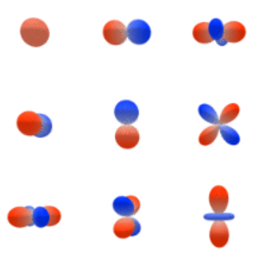

# Coordinate Transformations and Physical Modeling — From **PINN** to **GNN**

{fig-align="center"}

## I. Neural Networks and PINNs (Physics-Informed Neural Networks)

I will assume that the basic ideas of neural networks and PINNs are already familiar.

### 1. Neural networks and the LOSS function

Skipped.

### 2. PINN: just put the physics into the LOSS!

A traditional neural network is a black box. It does not naturally contain prior physical knowledge. This often leads to slow convergence and a large demand for data.

So what should we do when the problem involves complicated **coordinate transformations** or constraints from **physical differential equations**?

A **PINN (Physics-Informed Neural Network)** gives a very simple and direct answer: **you do not need to change the network structure. Just write the physical law as a penalty term and add it to the LOSS.**

- **In formula form**:

$$
Loss = Loss_{data} + \lambda Loss_{physics}
$$

- **Simple picture**: the network does not only need to fit the given data. If its output breaks the physical rules, for example if the result is wrong after rotating the coordinate system or if energy is not conserved, then $Loss_{physics}$ becomes large. The optimizer is then pushed toward a solution that follows the physical rules.

Put the TinNet figure here.

\![Fig. 1: Schematic illustration of the theory-infused neural network (TinNet).\]\[1\]

Xin 2021, *Nature Communications*. \[1\]

It looks complicated, but the basic idea is simple. On the left, you have a normal neural network or GNN. On the right, you write important parts of the known physical equations into the LOSS.

This is work from my group. Over the years, I have slowly changed how I think about this paper.

Now I feel that getting one energy value extremely accurate may not be the most interesting part. What is more interesting is whether we can add some physical constraints to a neural network, and then extract other physical information that was not directly put into the model.

------------------------------------------------------------------------

## II. Graph Neural Networks (GNNs): removing the absolute coordinate system

A **graph neural network (GNN)** turns a molecule directly into a graph. Atoms are nodes, while chemical bonds or distances are edges. This gives a simpler way to describe spatial relations.

### 1. The core idea of a GNN: message passing

The calculation in a GNN is a bit like collecting information from a group of friends:

1. **Message construction**: each atom uses the edges, such as distances, to collect features from nearby atoms.
2. **Aggregation**: the messages from neighboring atoms are combined, for example by the $\bigoplus$ summation operation in the figure.
3. **Update**: the atom combines its old state with the aggregated information from its neighbors and obtains a new feature for this layer.

\[2\]\[3\] explain this clearly. The process involves the adjacency matrix and the graph Laplacian.

*(Figure note: the classic GNN aggregation process. Starting from layer 0, each node collects information from nearby nodes. You can see the node colors gradually become darker.)*

### 2. A major weakness of GNNs: they are hard to make deep, so Scaling Law is difficult to use

We are now in an age where large models often follow the idea that "more scale can bring better results." This is the world of the **Scaling Law** **[Scaling Law](The_Seventh_Starling_and_Scale_Free_new.en.md)**.

In this setting, GNNs can be awkward:

- **Over-smoothing**: if a GNN becomes too deep, for example more than about 8 layers, repeated message passing can make the features of different atoms become too similar. The network then loses its ability to distinguish them.
- **Scaling Law is hard to use**: a Transformer can simply stack hundreds of layers and use more compute to gain accuracy. A GNN often cannot be made very deep in the same way. Even with more compute, increasing depth does not always help. This becomes a major limit in the current AI era.

------------------------------------------------------------------------

## III. Molecular structure prediction: invariance and equivariance

For a molecular structure, when we rotate the whole coordinate system, a GNN and the physical quantities need to follow two very different mathematical rules.

### 1. Energy: rotational invariance

- **Physical idea**: no matter how you rotate or translate a water molecule in space, its total internal energy should remain **exactly the same**.
- **What a normal GNN does**: a standard GNN can handle this quite easily because it often uses only the relative distances between atoms. Distance is a scalar and does not change when the coordinate system is rotated.

### 2. Dipole moment / force: rotational equivariance

- **Physical idea**: dipole moment and force are vectors with a **direction**. If you rotate the three-dimensional coordinate system or the molecule by $90^\circ$, the dipole moment and force must also rotate by exactly $90^\circ$. This is called **equivariance**.
- **What a normal GNN does**: a standard GNN can fail here. If it only uses distance information, it does not know the original three-dimensional direction. If we directly give it absolute 3D coordinates, it can easily learn a wrong directional relation that does not obey the correct rotation rule.
- **Conclusion**: when we want to predict vectors such as dipole moments or forces, a normal network is no longer enough. We need an **SO(3)-equivariant neural network**. It uses ideas related to **spherical tensor operators** from quantum mechanics and builds the rules of three-dimensional rotation directly into the network.

## 3. SO(3)-equivariant neural networks

The main examples are **e3nn**, **NequIP**, and **MACE**. Here I will focus on e3nn. NequIP and MACE may be similar in spirit, but honestly I do not have the energy to write all of them here...

In one sentence, the idea is this:

When we discussed the **Wigner-Eckart theorem**, we transformed Cartesian coordinates $x,y,z$ into spherical tensor operators. e3nn does something similar. It builds this mapping into a graph neural network so that equivariance is preserved.

**[Wigner-Eckart theorem in SFG](SFG_QM math-cleaned-v2.en.md)**

In chemistry, we often describe atomic orbitals using $(n,l,m)$. The principal quantum number $n$ controls the radial part, while $l$ and $m$ control the angular part.

For example, an s orbital $(n=1, l=0, m=0)$ is spherical. Since $l=0$ and $m=0$, it does not grow any "horns."

For a spherical tensor operator $T^k_q$, we can make the connection $k=l$ and $q=m$. In this sense, it corresponds to the angular part of the wavefunction.

When $k=1$, there are $2k+1=3$ possible values of $q$:

$$
q=-1, 0, +1
$$

The $q=0$ component corresponds directly to the $p_z$ orbital. The $q=+1$ and $q=-1$ components can be combined linearly to give the familiar $p_x$ and $p_y$ orbitals.

So $T^1_0$ corresponds directly to the $p_z$ orbital.

The $p_x$ and $p_y$ orbitals are linear combinations of $T^1_{+1}$ and $T^1_{-1}$.

Using the standard phase convention in quantum mechanics:

$$
p_x \propto \frac{1}{\sqrt{2}}\left(T^1_{-1} - T^1_{+1}\right)
$$

$$
p_y \propto \frac{i}{\sqrt{2}}\left(T^1_{-1} + T^1_{+1}\right)
$$

The following is the mathematical and computational process for building an $SO(3)$-equivariant graph neural network from beginning to end with the `e3nn` framework.

We will use one water molecule, $H_2O$, as an example. We set the maximum angular quantum number to $l_{\text{max}}=1$ and explain the physical and geometric meaning of the main parameters at the same time.

**Step 1: Initial node features (Embedding)**

Map each discrete atom type into learnable scalar features inside the network.

$$
x_{i,c,0}^{(0)} = \text{Embedding}(Z_i)_c
$$

- $i$: index of the central atom. For $H_2O$, when we calculate the oxygen atom, $i=O$.
- $Z_i$: atomic number, for example $Z_O=8$.
- $c$: feature-channel index, for example $c \in \{1, \dots, 64\}$. You can imagine that $c_1$ stores something related to electronegativity, $c_2$ stores something related to atomic mass, and so on.
- Superscript $(0)$: angular quantum number $l=0$. This means the feature is a **rotationally invariant scalar**.
- Subscript $0$: magnetic quantum number $m=0$. When $l=0$, the only possible value of $m$ is $0$.
- **Physical meaning**: the network starts with basic chemical information for each atom. At this stage, it has not yet seen the spatial structure. Therefore, all initial higher-order tensor features with $l \ge 1$ are zero.

**Step 2: Building the spatial geometric basis**

Calculate the relative distance and direction between atom $i$, such as $O$, and a neighboring atom $j$, such as $H_1$. Then map the direction into **spherical harmonics**.

$$
\mathbf{r}_{ij} = \mathbf{r}_j - \mathbf{r}_i,
\qquad
r_{ij} = \left\lVert \mathbf{r}_{ij} \right\rVert,
\qquad
\hat{\mathbf{r}}_{ij} = \frac{\mathbf{r}_{ij}}{r_{ij}}
$$

$$
Y_{m_2}^{(l_2)}\left(\hat{\mathbf{r}}_{ij}\right)
$$

- $l_2$: angular order of the geometric filter. In this example, $l_2 \in \{0,1\}$.
- $m_2$: component belonging to $l_2$. When $l_2=1$, which represents a direction vector, $m_2 \in \{-1,0,1\}$.
- **Geometric meaning**: the scalar distance $r_{ij}$ controls the strength of the physical interaction. The spherical harmonic $Y$ converts the 3D relative direction $\hat{\mathbf{r}}_{ij}$ into an equivariant geometric basis. You can think of it as the "steering wheel" of the spatial convolution.

**Step 3: Parameterized tensor products and message passing**

The key operation in `e3nn` combines the feature of a neighboring atom $H_1$ with the geometric basis and produces a message that is sent to the central atom $O$.

$$
m_{i,c,M}^{(L)}
=
\sum_{j \in \mathcal{N}(i)}
\sum_{l_1, l_2}
\sum_{m_1, m_2}
C_{l_1 m_1, l_2 m_2}^{L M}
\cdot
W_{c,c'}^{(L,l_1,l_2)}(r_{ij})
\cdot
x_{j,c',m_1}^{(l_1)}
\cdot
Y_{m_2}^{(l_2)}\left(\hat{\mathbf{r}}_{ij}\right)
$$

- $l_1, m_1$: angular order of the neighboring feature $x_j$. In the first layer, $l_1=0$ and $m_1=0$.

- $L, M$: angular order of the new feature after combining the inputs. When $l_1=0$ and $l_2=1$, the selection rule is

$$
\left|l_1-l_2\right| \le L \le l_1+l_2
$$

so the output has $L=1$, with $M \in \{-1,0,1\}$.

- $C_{l_1 m_1, l_2 m_2}^{L M}$: **Clebsch-Gordan coefficient**. This is a fixed number from quantum mechanics. It makes sure that when two spherical objects are combined, the result still follows the symmetry rules of the $SO(3)$ group.

Its physical meaning is simple: it tells us how to combine two spherical tensors correctly. If we simply added spherical tensors the way we add normal neural-network features, the dimensions might not match, and more importantly, equivariance would not be guaranteed.

- The CG coefficient combines the different $W \times x \times Y$ blocks in the correct way.

- $W(r_{ij})$: the weight matrix. These parameters are updated during backpropagation.

- **Physical meaning**: this step describes how the chemical state of the neighboring atom $H_1$, represented by $x_j$, moves along a specific spatial direction $Y$ and distance-dependent weight $W$ to influence the central atom $O$. At the same time, angular-momentum rules remain satisfied throughout the process.

**Step 4: Updating the node state and gated activation**

After all neighboring messages are combined, they are mixed with the atom's own feature. Then we apply an activation rule that does not destroy the directional information.

$$
z_{i,c,M}^{(L)}
=
\sum_{c'}
V_{c,c'}^{(L)}
x_{i,c',M}^{(L)}
+
m_{i,c,M}^{(L)}
$$

$$
h_{i,c,M}^{(L)}
=
\begin{cases}
\sigma\left(z_{i,c,0}^{(0)}\right), & \text{if } L=0,\\[4pt]
\sigma\left(s_{i,c,0}^{(0)}\right)\cdot z_{i,c,M}^{(L)}, & \text{if } L>0.
\end{cases}
$$

- $V$: a learnable linear matrix that mixes feature channels.
- $s^{(0)}$: an extra scalar with $l=0$ predicted by the network for higher-order tensors with $L>0$. For an $L=0$ scalar, we can use a normal activation function.
- **Geometric meaning**: if we directly apply a nonlinear activation function to a 3D vector with $L=1$, we may change its direction in an unphysical way. Instead, we use the scalar $\sigma(s)$ as a scaling factor, or **Gate**, and multiply the vector by it. This changes only the magnitude, not the direction, and therefore preserves rotational equivariance.

**Step 5: Readout**

After several message-passing layers, we take the scalar features of the atoms and use them to predict macroscopic physical quantities.

$$
E_i = \text{MLP}\left(h_{i,c,0}^{(0)}\right),
\qquad
E_{\text{total}} = \sum_i E_i
$$

- **Physical meaning**: the total energy $E_{\text{total}}$ is rotationally invariant. Therefore, in the readout stage, we use the $L=0$ scalar features and do not directly use the $L>0$ tensor features.

Finally, we can take the derivative of the total energy with respect to the input coordinate $\mathbf{r}_i$:

$$
\mathbf{F}_i = -\nabla_{\mathbf{r}_i} E_{\text{total}}
$$

This gives atomic forces that transform equivariantly under rotation.

## The Bitter Lesson

Even though the mathematics and physics of SO(3) look very reasonable, I still want to put *The Bitter Lesson* here.

*The Bitter Lesson*, written by Rich Sutton on March 13, **2019** \[7\], looks back at about 70 years of AI development. Its main lesson is that general methods that can make full use of large-scale computation have often beaten methods that depend heavily on human expert knowledge and carefully designed priors.

We can also see something related to this in AlphaFold.

AlphaFold **1**, released in **December 2018**, used a very deep 2D ResNet/CNN. AlphaFold **2**, released in **November 2020**, moved into an era centered on attention and Transformer ideas. It also explicitly built rigid-body rotation and translation equivariance into the Structure Module.

**AlphaFold 3, released in May 2024, kept a Transformer-like backbone but removed the explicit rotation/translation-equivariant architecture used in the AF2 Structure Module. It instead used a standard Transformer, diffusion, and random rigid rotation/translation augmentation.**

"AlphaFold 4," or the Isomorphic Labs Drug Design Engine (IsoDDE), was released in February 2026. For now, we still do not know whether they have completely moved away from injecting physical structure into the model.

So should physical symmetry be hard-coded into a network, or should a large enough model learn it from data?

**AlphaFold 2 → AlphaFold 3 may be one useful example of this question.**

Alexander Amini, a leader in Microsoft's **AI4S** effort, has also said in an MIT public lecture that he tends not to favor putting too much physics directly into neural networks.

MIT 6.S191: AI for Science \[8\]

We can also use **data augmentation** to let a neural network learn equivariance. For example, we can rotate a molecule by $45^\circ$ and $270^\circ$ and tell the network that the physical value should remain the same.

But we should also notice that *Uni-Mol3* from DP Technology (**2025**) \[citation\], [arXiv:2508.00920](https://arxiv.org/abs/2508.00920), still uses equivariant ideas or explicit physical constraints.

Maybe this is because their main focus includes MD tasks, where directional accuracy is very important.

**Perhaps explicit equivariance still has real value in scientific problems where the amount of data is not very large, or in early-stage models where we already know some strong physical rules.**

###### 

------------------------------------------------------------------------

## References and Links

\[1\] Xin 2021 nature com.\
https://www.nature.com/articles/s41467-021-25639-8\
Fig. 1: Schematic illustration of the theory-infused neural network (TinNet).\
https://media.springernature.com/full/springer-static/image/art%3A10.1038%2Fs41467-021-25639-8/MediaObjects/41467_2021_25639_Fig1_HTML.png

\[2\] https://distill.pub/2021/gnn-intro/

\[3\] https://theaisummer.com/gnn-architectures/

\[4\] Tian Xie Crystal Graph Convolutional Neural Networks for an Accurate and Interpretable Prediction of Material Properties. Phys. Rev. Lett. **120**, 145301 – **Published 6 April, 2018**

\[7\] The Bitter Lesson. Rich Sutton. March 13, 2019.\
https://www.cs.utexas.edu/\~eunsol/courses/data/bitter_lesson.pdf

\[8\] Alexander Amini, Microsoft AI4S. MIT 6.S191: AI for Science\
https://www.youtube.com/watch?v=rZACoZD8AG8
