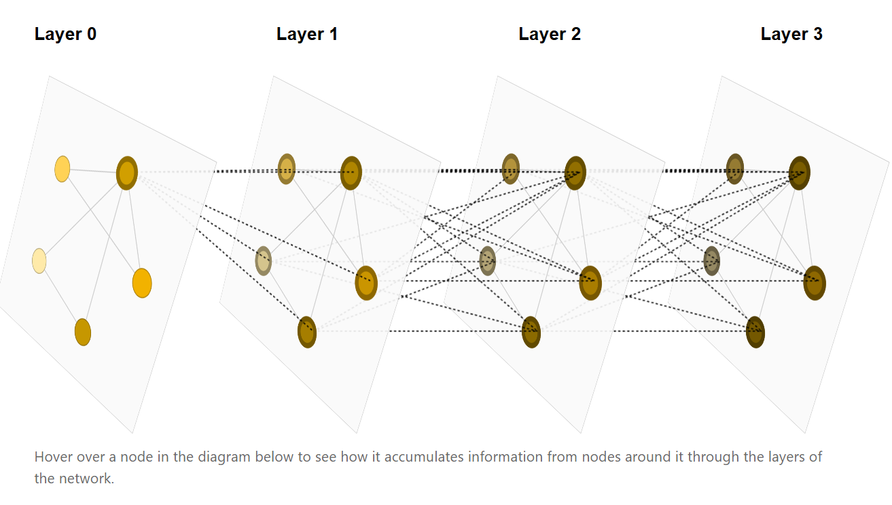

# 坐标系变换与物理建模 —— 从 **PINN** 到 **GNN**

## 一、 神经网络基础与 PINN (物理信息神经网络) 默认大家都熟悉

### 1. 神经网络与 LOSS 函数

略

### 2. PINN：损失加在 LOSS 就好了！

传统的神经网络不懂物理常识。当面临复杂的**坐标系变换**或者**物理微分方程**约束时，该怎么办？

**PINN (Physics-Informed Neural Networks)** 给出了一种极其简单粗暴的方法：**不需要改网络结构，直接把物理定律当作惩罚项，加在 LOSS 里！**

* **公式体现**：

$$
Loss = Loss_{data} + \lambda Loss_{physics}
$$

* **通俗理解**：你不仅要拟合给定的数据，如果你输出的结果不遵守物理规则（比如坐标系旋转后结果对不上，或者不符合能量守恒），$Loss_{physics}$ 就会变得很大，强制优化器去寻找符合物理规律的解。

这边放TINNET图片

![Fig. 1: Schematic illustration of the theory-infused neural network (TinNet).][1]

Xin 2021 nature com. [1]

看起来很复杂,其实就是左边做个普通的神经网络或者GNN,右边把已知的物理公式部分关键项写入LOSS.

我老板的工作,这些年慢慢的体会这篇文章.现在的感觉是预测准确已经不重要,重要的是能不能从对神经网络加入一些物理限制,然后中榨取更多的另一些没有加入的物理信息,这才是有趣的吧.

---

## 二、 图神经网络 (GNN)：抛弃绝对坐标系

为了避开“全局坐标系变化”带来的困扰，我们引入了**图神经网络（GNN）**。GNN 直接把分子变成一个“图”：原子是节点，化学键或距离是边，从而降维处理空间关系。

### 1. GNN 的核心机制：消息聚合 (Message Passing)

GNN 的计算过程，就像是一次“朋友圈收集信息”的过程：

1. **消息构造 (Message)**：每个原子根据边（距离），提取周围邻居原子的特征。
2. **聚合 (Aggregation)**：把周围邻居传来的信息打包（比如图中的 $\bigoplus$ 求和操作）。
3. **更新 (Update)**：结合自己原有的状态和打包后的邻居信息，更新自己这一层的新特征。

[2]

[3] 说的很清楚,这里面涉及到计算邻接矩阵和图的拉普拉斯变换.

*(图注：GNN 的经典聚合过程，从第0成开始把周围节点的信息拿过来,可以看到节点颜色逐渐变深)*

Crystal Graph Convolutional Neural Networks for an Accurate and Interpretable Prediction of Material Properties Tian Xie [4] and Jeffrey C. Grossman [5] Phys. Rev. Lett. 120, 145301 – Published 6 April, 2018 [6]

### 2. GNN 的致命软肋：做不深，Scaling Law 不好施展

在目前大模型“大力出奇迹”（**Scaling Law**）的时代，GNN 显得非常尴尬：

* **过平滑 (Over-smoothing) 现象**：如果 GNN 层数做深（比如超过 8 层），经过多次“朋友圈消息传递”，最后所有原子的特征都会趋于同质化，网络失去分辨能力。
* **Scaling Law 施展不开**：Transformer 可以无脑堆叠几百层，通过海量算力换取精度；而 GNN 浅尝辄止，算力再大也无法有效加深，导致其在暴力美学的 AI 时代遇到了极大的瓶颈。
* 阿尔法fold 1 2 3 4是Transformer架构的,确定一下是不是正确

---

## 三、 分子结构预测：不变性 (Invariance) 与 等变性 (Equivariance)

面对分子结构，当我们旋转整个坐标系时，GNN 和物理量需要满足两种截然不同的数学约束：

### 1. 能量 (Energy)：旋转不变性 (Invariance)

* **物理常识**：无论你把一个水分子在空间中怎么旋转、平移，它内部蕴含的总能量是**绝对不变**的。
* **GNN 的表现**：普通的 GNN 可以轻松做到这一点。因为普通 GNN 只提取原子之间的“相对距离”，而距离本身就是不受坐标系旋转影响的标量。

### 2. 偶极矩 (Dipole Moment) / 受力 (Force)：旋转等变性 (Equivariance)

* **物理常识**：偶极矩和受力是有**方向**的矢量（向量）。如果你把三维坐标系或者分子旋转了 $90^\circ$，偶极矩和受力的方向也必须**跟着极其精确地旋转 $90^\circ$**！这就叫**等变性（Equivariance）**。
* **GNN 的表现**：普通的 GNN 在这里会彻底失效。如果只输入距离信息，它根本不知道原本的三维方向在哪；如果直接把三维绝对坐标输入网络，它又很容易拟合出违背“同等旋转”物理规律的错误方向。
* **结论引入**：正因如此，在预测偶极矩、受力等向量时，普通的网络走到了尽头，我们必须引入 **SO(3) 等变神经网络**，利用量子力学中的**球张量算符**，将三维空间的旋转规则硬编码到神经网络的底层逻辑中。

## 3.SO(3)等变神经网络

主要是**e3nn**、**NequIP** 和 **MACE**,我们重点讨论e3nn. NequIP 和 MACE我想可能是差不多的吧,主要是我实在是写不动了...

一句话简单的说,之前我们搞**维格兰艾卡定理**时候,涉及到把笛卡尔坐标xyz变成球张量算符.现在这个e3nn也是,e3nn只是做一个映射结合图神经网络,保证了等变性.

在化学中，我们常常见到电子的原子轨道 $(n,l,m)$，其中主量子数 $n$ 决定径向部分，$l$ 和 $m$ 决定角向部分。比如 s 轨道 $(n=1, l=0, m=0)$ 是一个球，因为 $l=0, m=0$ 所以没有长出‘犄角’。对应到球张量算符 $T^k_q$，其中 $k=l, q=m$，这就等价于波函数的角向部分。比如当 $k=1$ 时，$q$ 共有 $2k+1=3$ 个取值，即 $q=-1, 0, +1$。其中 $q=0$ 直接对应 $p_z$ 轨道，而 $q=+1$ 和 $q=-1$ 分量经过线性组合后，就构成了我们熟悉的 $p_x$ 和 $p_y$ 轨道。$T^1_0$ 直接对应 $p_z$ 轨道.

**$p_x$ 和 $p_y$ 是由 $T^1_{+1}$ 和 $T^1_{-1}$ 线性组合而成的**。

根据标准的量子力学相位约定：

$$
p_x \propto \frac{1}{\sqrt{2}}\left(T^1_{-1} - T^1_{+1}\right)
$$

$$
p_y \propto \frac{i}{\sqrt{2}}\left(T^1_{-1} + T^1_{+1}\right)
$$

这是利用 `e3nn` 框架实现 $SO(3)$ 等变图神经网络从头到尾的数学推导与计算过程。我们将以一个水分子（$H_2O$）为例，设定最大角量子数 $l_{\text{max}} = 1$，同步展示具体参数的物理与几何意义。

**Step 1: 节点初始特征提取 (Embedding)**

将离散的原子种类映射为网络内部的可学习标量特征。

$$
x_{i,c,0}^{(0)} = \text{Embedding}(Z_i)_c
$$

* $i$: 中心原子索引。在 $H_2O$ 中，计算氧原子时 $i=O$。
* $Z_i$: 原子的化学序数（如 $Z_O=8$）。
* $c$: 特征通道维度（如 $c \in \{1, \dots, 64\}$）。比如你可以设置c1是不同原子的电负性,c2是原子质量等等.
* 上标 $(0)$: 角量子数 $l=0$，代表该特征是**旋转不变的标量**。
* 下标 $0$: 磁量子数 $m=0$。当 $l=0$ 时，$m$ 只能取 $0$。
* **物理意义**：初始化赋予原子基础的化学属性。此时网络尚未感知空间结构，因此初始高阶张量（$l \ge 1$）特征全为 $0$。

**Step 2: 空间几何基底生成**

计算原子 $i$（如 $O$）与其邻居 $j$（如 $H_1$）之间的相对距离与方向，并映射为**球谐函数**。

$$
\mathbf{r}_{ij} = \mathbf{r}_j - \mathbf{r}_i,
\qquad
r_{ij} = \left\lVert \mathbf{r}_{ij} \right\rVert,
\qquad
\hat{\mathbf{r}}_{ij} = \frac{\mathbf{r}_{ij}}{r_{ij}}
$$

$$
Y_{m_2}^{(l_2)}\left(\hat{\mathbf{r}}_{ij}\right)
$$

* $l_2$: 几何滤波器的角量子数，示例中 $l_2 \in \{0, 1\}$。
* $m_2$: 对应 $l_2$ 的分量。当 $l_2=1$ 时（代表方向向量），$m_2 \in \{-1, 0, 1\}$。
* **几何意义**：标量距离 $r_{ij}$ 决定物理相互作用的绝对强度；球谐函数 $Y$ 将 3D 相对方向 $\hat{\mathbf{r}}_{ij}$ 转换为等变的几何基底，作为空间卷积的“方向盘”。

**Step 3: 参数化张量积与消息聚合 (Message Passing)**

利用 `e3nn` 的核心操作，将邻居原子 $H_1$ 的特征与几何基底结合，生成传递给 $O$ 原子的消息。

$$
m_{i,c,M}^{(L)}
=
\sum_{j \in \mathcal{N}(i)}
\sum_{l_1, l_2}
\sum_{m_1, m_2}
C_{l_1 m_1, l_2 m_2}^{L M}
\cdot
W_{c,c'}^{(L,l_1,l_2)}(r_{ij})
\cdot
x_{j,c',m_1}^{(l_1)}
\cdot
Y_{m_2}^{(l_2)}\left(\hat{\mathbf{r}}_{ij}\right)
$$

* $l_1, m_1$: 邻居特征 $x_j$ 的阶数。第一层时 $l_1=0, m_1=0$。

* $L, M$: 融合后的新特征阶数。当 $l_1=0, l_2=1$ 时，根据选择定则

$$
\left|l_1-l_2\right| \le L \le l_1+l_2
$$

输出 $L=1$，此时 $M \in \{-1, 0, 1\}$。

* $C_{l_1 m_1, l_2 m_2}^{L M}$: **Clebsch-Gordan 系数**。量子力学查表常数，用于保证基底相乘后的 $SO(3)$ 群对称性守恒。物理意义就是把两个球张量拼起来,如果向普通神经网络那样直接加球张量一方面是维度不对,一方面是不能保证等变.

* 这里CG系数的作用,负责融合不同的 $W \times x \times Y$ 整体块。

* $W(r_{ij})$: 权重矩阵,到时候反向传播更新它。

* **物理意义**：计算邻居 $H_1$ 的化学态（$x_j$）如何沿着特定的相对空间方向（$Y$）和距离（$W$）流动并影响中心原子 $O$，且保证全过程角动量守恒。

**Step 4: 节点状态更新与门控激活**

聚合所有邻居消息后，与自身特征进行线性混合，并施加不破坏方向性的激活函数。

$$
z_{i,c,M}^{(L)}
=
\sum_{c'}
V_{c,c'}^{(L)}
x_{i,c',M}^{(L)}
+
m_{i,c,M}^{(L)}
$$

$$
h_{i,c,M}^{(L)}
=
\begin{cases}
\sigma\left(z_{i,c,0}^{(0)}\right), & \text{if } L=0,\\[4pt]
\sigma\left(s_{i,c,0}^{(0)}\right)\cdot z_{i,c,M}^{(L)}, & \text{if } L>0.
\end{cases}
$$

* $V$: 网络可学习的线性通道混合矩阵。
* $s^{(0)}$: 网络专门为高阶张量 $L>0$ 额外预测出的配对标量（$l=0$）。L=0 标量随便做激活函数.
* **几何意义**：如果直接对一个 3D 向量 ($L=1$) 施加非线性激活，会使其偏离原有方向。用标量 $\sigma(s)$ 充当缩放系数（**Gate**）去乘向量，只改变大小、不改变方向，完美维系了坐标系的旋转等变。

**Step 5: 读出阶段 (Readout)**

经过多层传递后，提取原子的标量特征预测宏观物理量。

$$
E_i = \text{MLP}\left(h_{i,c,0}^{(0)}\right),
\qquad
E_{\text{total}} = \sum_i E_i
$$

* **物理意义**：体系总能量 $E_{\text{total}}$ 是旋转不变量，因此读出时直接抛弃所有 $L>0$ 的张量特征。最后，可通过对总能量关于输入坐标 $\mathbf{r}_i$ 求偏导

$$
\mathbf{F}_i = -\nabla_{\mathbf{r}_i} E_{\text{total}}
$$

自动输出严格等变的原子受力预测值。

## The Bitter Lesson

尽管SO3的数学和物理看起来这么合理,但是我还是把The Bitter Lesson放在这里.

The Bitter Lesson Rich Sutton March 13, **2019 **[7] 讲述了在卷积神经网络CNN和计算机视觉的时代,人工智能 70 年发展历史所揭示的最大教训是：能够充分利用大规模计算资源的通用方法，最终都以绝对优势战胜了依赖人类专家知识与精巧先验的方法。

我们也可以从拿了诺奖的AlphaFold模型中看见, AlphaFold **1**发布于**2018**年12月,是很深的 2D ResNet/CNN；AlphaFold **2** 发布于**2020**年11月进入以attention/Transformer 思想为核心的时代，并且在 Structure Module 中显式加入了刚体旋转/平移等变性；**AlphaFold 3 发布于2024年5月保留 Transformer-like 主干，但明确抛弃了 AF2 Structure Module 中显式的旋转/平移等变架构，改成普通 Transformer + diffusion + 随机刚体旋转/平移增强。**"AlphaFold 4" 也就是Isomorphic Labs Drug Design Engine（IsoDDE）在2026年2月发布,我们暂时还不知道他们是否已经完全放弃物理模型的注入.

物理对称性应该硬编码进网络，还是让足够大的模型从数据中学习？​**AlphaFold 2 → AlphaFold 3 或者提供了一个案例之一。**

微软 **AI4S** 的 leader , Alexander Amini 在MIT公开课上也曾呼吁他偏向于不相信加入太多的物理到神经网络里. MIT 6.S191: AI for Science [8]

我们可以用**数据增强**的方法让神经网络学到这些等变,比如把分子转动个 $45^\circ$ 和 $270^\circ$ 告诉神经网络是一样的数值。但是也要注意到在深势科技的*Uni-Mol3* (**2025**) [引用] [ arXiv:2508.00920](https://arxiv.org/abs/2508.00920), 还是坚持使用等变或加入物理约束. 或许是因为他们的主要关注的MD任务对方向准确的要求比较高, **也许在数据不大的Science领域或初创公式等变还是有其一定的价值.**

###### 

---

## 参考文献与网址

[1] Xin 2021 nature com.  
https://www.nature.com/articles/s41467-021-25639-8  
Fig. 1: Schematic illustration of the theory-infused neural network (TinNet).  
https://media.springernature.com/full/springer-static/image/art%3A10.1038%2Fs41467-021-25639-8/MediaObjects/41467_2021_25639_Fig1_HTML.png

[2] https://distill.pub/2021/gnn-intro/

[3] https://theaisummer.com/gnn-architectures/

[4] Tian Xie  
https://journals.aps.org/search/field/author/Tian%20Xie

[5] Jeffrey C. Grossman  
https://journals.aps.org/search/field/author/Jeffrey%20C%20Grossman

[6] Crystal Graph Convolutional Neural Networks for an Accurate and Interpretable Prediction of Material Properties. Phys. Rev. Lett. **120**, 145301 – **Published 6 April, 2018**

[7] The Bitter Lesson. Rich Sutton. March 13, 2019.  
https://www.cs.utexas.edu/~eunsol/courses/data/bitter_lesson.pdf

[8] 微软AI4S 的 Alexander Amini. MIT 6.S191: AI for Science  
https://www.youtube.com/watch?v=rZACoZD8AG8
