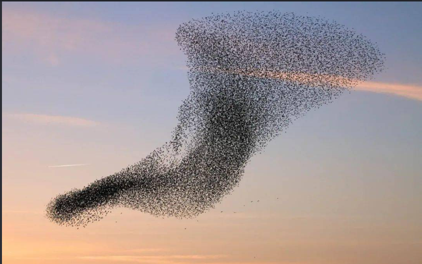
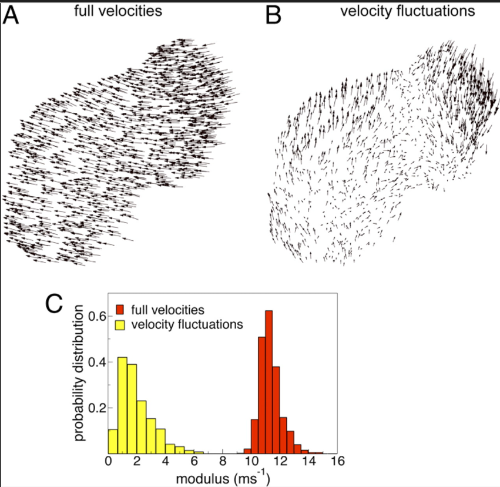
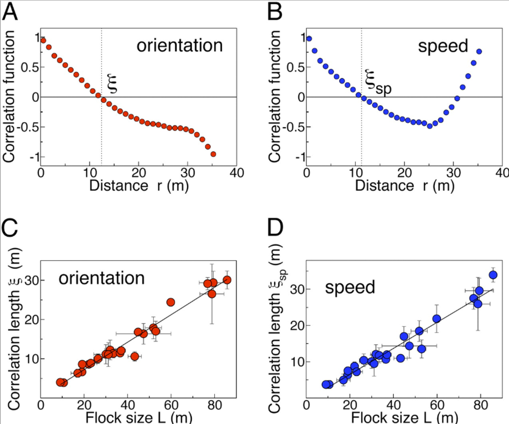
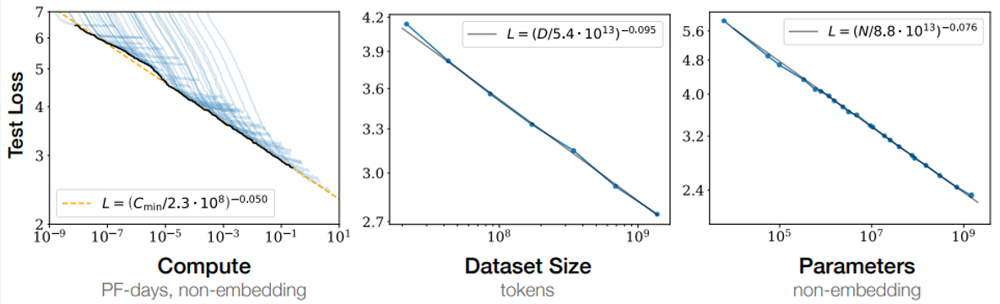

# The Seventh Starling and Scale-free

Haha, you may ask me: why is someone working in chemistry getting involved in all these different things?

My answer is: aren't you curious?

This time, I want to look at **scale-free** behavior in bird flocks and the **scaling law** of large language models. Let me say this first: what follows is mostly my own wandering thought. I mainly want to introduce another way of thinking about the H-bond network and long-range interactions in water. Maybe correlated vibrational spectroscopy, obtained from SHS signals with different polarization combinations, can help us find something interesting. Who knows?

------------------------------------------------------------------------

## The Seventh Starling: how does local interaction become global correlation?

Let us start with starlings.

In *Scale-free correlations in starling flocks*, Parisi and co-workers used several cameras to reconstruct the three-dimensional positions, velocities, and directions of starlings in flight. They then compared the velocity fluctuations of one bird with those of other birds.\[1\]

They found something very interesting. A starling does not interact with every bird inside a fixed distance. Instead, it interacts with a roughly fixed number of neighbors, about 7–11 birds. They called this a **topological interaction**.

In other words, one bird receives only a small amount of local information, but the whole flock can still show collective motion over a very large scale.

For flocks of different sizes, they found that the correlation length of velocity fluctuations increases with the linear size of the flock. The larger the flock becomes, the farther the influence of each bird can extend:

$$
\xi \propto L
$$

Here, $L$ is the size of the flock and $\xi$ is the correlation length. This is one important feature of **scale-free correlation**: the system does not have one fixed intrinsic correlation length.

$$
\text{local interaction}
\rightarrow
\text{long-range correlation}
\rightarrow
\text{collective behavior}
$$

Of course, a bird flock is an active biological system. But could something similar happen in an H-bond network?

{width="468"}

{width="461"}

------------------------------------------------------------------------

## Scaling law: why do I put it together with scale-free behavior?

I have often compared this with the scaling law of neural networks.\[2–4\]

For an LLM, or large language model, the basic idea of a scaling law is simple: **when compute, data, and the number of parameters increase, the loss decreases in a fairly stable way. Over a wide range of scales, this behavior is often close to a power law.**

For example, Kaplan and co-workers found:

$$
L(N)-L_\infty \propto N^{-\alpha}
$$

This looks mathematically similar to a scale-free correlation often seen in statistical physics:

$$
C(r)\propto r^{-\gamma}
$$

Both have a scaling structure. When the scale changes, the form of the function stays similar, with only a power factor changing.

But we need to keep an important difference in mind: **the scaling law of an LLM does not prove that the inside of a neural network is a scale-free critical system.**

In Kaplan's work, $N$ is the system size across different models. In the starling case, $r$ is a spatial distance inside the same system. For now, the similarity is mainly mathematical. It does not mean that the two systems have been shown to share the same physical mechanism.

There is another point worth mentioning. Full attention in a normal Transformer is not a very good direct analogy for the local interaction of starlings. In one attention layer, a token can in principle read the whole context. The interaction is all-to-all. Local or sparse attention is closer to the picture of "interacting only with neighbors."

So what I really want to compare is a broader question: how can local rules produce macroscopic collective behavior? I do not want to match attention directly to the seven neighbors of a starling.

Here is a rough history of scaling-law research in LLMs:

| Paper | Main question | Main conclusion |
| --- | --- | --- |
| Hestness et al. 2017 | Does deep learning show predictable scaling behavior? | **Yes. Error decreases approximately as a power law with data and model size.** |
| Kaplan et al. 2020 | How do parameters, data, and compute affect language-model loss? | **Loss follows approximate power laws with parameter count** $N$, data $D$, and compute $C$. |
| Hoffmann et al. 2022, Chinchilla | With fixed compute, should we spend more on parameters or data? | **Kaplan placed too much weight on increasing model size. Chinchilla argued that model size and training tokens should grow at roughly the same rate.** |
| Wei et al. 2022 | If loss decreases smoothly, why do some abilities seem to appear suddenly? | **Some downstream abilities appear to show a threshold or emergence instead of simple smooth growth.** |

Of course, the picture is less simple today. We now have MoE, reinforcement learning, post-training, continual learning, and inference-time compute. The relation between parameters, data, and compute is no longer as simple as in the early scaling laws.

Still, power-law scaling remains a useful way to look at the problem.

------------------------------------------------------------------------

## Could an H-bond network also be scale-free?

This is the question I really want to ask.

An H bond itself is clearly a short-range interaction. One hydrogen bond connects only a few neighboring water molecules.

But **short-range interaction does not mean that a system can only have short-range correlation**.

If one water molecule changes its orientation, it changes the H-bond geometry with nearby water molecules. Those neighboring molecules then affect the next layer, and so on.

There are also higher-order dipole–dipole couplings between water molecules. By the way, when people add long-range terms to neural-network models for AIMD water, part of the goal is to make sure these dipolar interactions are represented. On top of this, ions and charged interfaces also create electric fields.

So a correlation function for water can be written as:

$$
C(r)
=
\left\langle
\delta \boldsymbol{\mu}(0)
\cdot
\delta \boldsymbol{\mu}(r)
\right\rangle
$$

The question is simple: for two water molecules separated by a distance $r$, can their orientation, polarization, or H-bond fluctuations still remain correlated?

People doing spectroscopic MD calculations are basically calculating things like this all the time.

Current evidence suggests that **water can indeed show long-range orientational correlation, but this does not automatically mean that the system is scale-free.**

In bulk water at room temperature, density structure is mainly short-range. However, simulations and scattering studies have found that dipolar or orientational correlations can extend farther. Work from Roke and others also suggests that dilute electrolytes can produce collective orientational responses over nanometer scales or even longer.\[5–8\]

But "long-range" only means that $\xi$ is large.

If

$$
C(r)\sim e^{-r/\xi}
$$

and $\xi$ is still a finite constant, then the system still has a characteristic length scale. It is not strictly scale-free.

A truly scale-free correlation is closer to:

$$
C(r)\sim r^{-\eta}
$$

We would also need to see the correlation length grow as the system size increases, instead of finally stopping at a fixed length of a few nanometers.

So does adding more ions make it easier to obtain "scale-free water"?

At low ion concentration, ion–dipole interactions, water–water cross-correlations, and the H-bond network can produce a collective response over a longer distance. But when the concentration becomes higher, ordered domains around different ions can overlap. Debye screening also becomes stronger. These effects may cut off the long-range correlation instead.\[5,6\]

In other words, the interesting question may not be "are more ions better?"

The real question may be whether there is a certain **concentration, temperature, surface charge density, or confinement condition** where the correlation length starts to grow in an unusual way.

From the temperature side, normal water at room temperature has not been shown to be a scale-free H-bond system.

But in supercooled water, the correlation length of density and H-bond-network fluctuations increases as the temperature approaches the liquid–liquid critical region.\[9\]

More interestingly, a 2026 paper in *Science* reported direct experimental evidence related to a liquid–liquid critical point in supercooled water. It observed stronger critical fluctuations near about $210\pm8\,\mathrm{K}$.\[10\]

If the system is really close to a critical point, this may be one of the most reasonable places to look for approximately scale-free correlations. The correlation length $\xi$ can grow rapidly. In the ideal critical limit, it can even approach divergence.

Another system I really want to look at is **water near macromolecular surfaces and cell membranes**.

This may be even more interesting because a surface adds a new boundary condition to the H-bond network. Surface charge, phospholipid head groups, hydrophilic and hydrophobic patches on proteins, curvature, and confinement can all rearrange the H-bond connectivity of water.

Some simulations have found that orientational order near charged interfaces can extend over several nanometers. Protein hydration layers may also show clear long-range dipolar cross-correlations. Adding $\mathrm{H_3O^+}$ near a membrane can further extend the perturbation of interfacial water.\[11–13\]

But these results still only show that **long-range or nonlocal response is possible**. They do not prove that water at a cell membrane is already scale-free.

If we really want to show that an H-bond network is scale-free, I think experiments and simulations should look at at least three things at the same time:

1. Does $C(r)$ follow a power law over a wide enough range of scales, rather than showing a long tail that is still exponential in the end?
2. Does the correlation length $\xi$ grow with system size, instead of staying fixed at a molecular or nanometer scale?
3. When we change temperature, ion concentration, interfacial charge, or membrane composition, do we see a systematic change similar to critical scaling, rather than only seeing that "the correlation becomes longer" under one condition?

This is also why I find SHS, SFG, and CVS very interesting.

If we can really find a condition where the H-bond network moves from a normal finite-$\xi$ state toward a state with a very large, or even approximately scale-free, correlation length, then the next question becomes very interesting:

**In such a collective solvent environment, could electron transfer, self-assembly, ion transport, or membrane permeation show dynamics that are fundamentally different from those in a solvent with only short-range correlations?**

This is why I want to look at **scaling law, scale-free behavior, the H-bond network, and long-range interaction** together.

They are clearly not the same theory. But they all point to a similar question:

$$
\text{when microscopic interactions are local, how can macroscopic behavior still span many scales?}
$$

------------------------------------------------------------------------

## References

1. Cavagna, A. et al. **Scale-free correlations in starling flocks.** *PNAS* **107**, 11865–11870 (2010).\
   https://www.pnas.org/doi/10.1073/pnas.1005766107

   Video: *The Seventh Starling: The Wonders of Collective Animal Behaviour*\
   https://www.carmin.tv/en/video/the-seventh-starling-the-wonders-of-collective-animal-behaviour

2. Hestness, J. et al. **Deep Learning Scaling is Predictable, Empirically.** arXiv:1712.00409 (2017).\
   https://arxiv.org/abs/1712.00409

3. Kaplan, J. et al. **Scaling Laws for Neural Language Models.** arXiv:2001.08361 (2020).\
   https://arxiv.org/abs/2001.08361

4. Hoffmann, J. et al. **Training Compute-Optimal Large Language Models.** NeurIPS (2022).\
   https://arxiv.org/abs/2203.15556

5. Chen, Y. et al. **Electrolytes induce long-range orientational order and free energy changes in the H-bond network of bulk water.** *Science Advances* **2**, e1501891 (2016).\
   https://pmc.ncbi.nlm.nih.gov/articles/PMC4846452/

6. Duboué-Dijon, E. & Laage, D. **Size and Origins of Long-Range Orientational Water Correlations in Dilute Aqueous Salt Solutions.** *J. Phys. Chem. B* **121**, 7026–7035 (2017).\
   https://pubmed.ncbi.nlm.nih.gov/28429943/

7. Kanth, J. M. P., Vemparala, S. & Anishetty, R. **Long-distance correlations in molecular orientations of liquid water and shape-dependent hydrophobic force.** *Phys. Rev. E* **81**, 021201 (2010).\
   https://pubmed.ncbi.nlm.nih.gov/20365555/

8. Omelyan, I. P. **Angular resolution and range of dipole-dipole correlations in water.** *J. Chem. Phys.* **120**, 3687–3701 (2004).\
   https://pubmed.ncbi.nlm.nih.gov/15268608/

9. Huang, C. et al. **Increasing correlation length in bulk supercooled H₂O, D₂O, and NaCl solution determined from small angle x-ray scattering.** *J. Chem. Phys.* **133**, 134504 (2010).\
   https://pubmed.ncbi.nlm.nih.gov/20942543/

10. You, S. et al. **Experimental evidence of a liquid-liquid critical point in supercooled water.** *Science* **391**, 1387–1391 (2026).\
    https://doi.org/10.1126/science.aec0018

11. Bandyopadhyay, D. et al. **How Far Is "Bulk Water" from Interfaces? Depends on the Nature of the Surface and What We Measure.** (2022).\
    https://pubmed.ncbi.nlm.nih.gov/35104127/

12. **Dipolar Cross-Correlations in Aqueous Systems: How Surfaces Influence Water's Action at a Distance.** (2025).\
    https://pubmed.ncbi.nlm.nih.gov/40390293/

13. **Effect of H₃O⁺ on the Structure and Dynamics of Water at the Interface with Phospholipid Bilayers.** (2020).\
    https://pubmed.ncbi.nlm.nih.gov/32003220/
