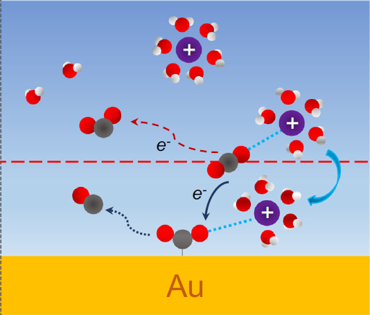
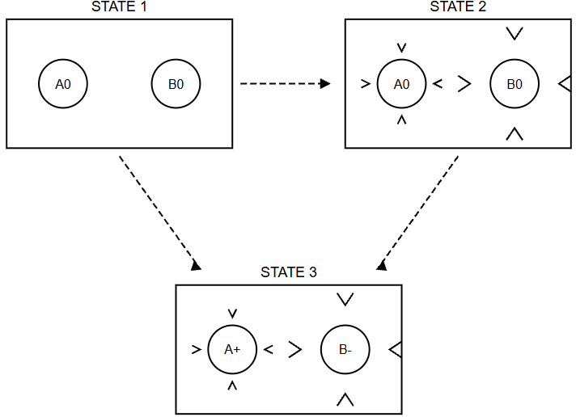

# Electrostatics and Outer-sphere Reorganization Energy

{fig-align="center" width="390"}

## Opening Summary

This part starts from the most basic electrostatics of dielectric media.

We first look at the relation between free charge, dielectric polarization, the electric displacement field, the electric field, and the electric potential.

Then we put these ideas into Marcus' continuum-solvent picture.

The main question is:

When electron transfer happens, why can the solvent's "fast polarization" and "slow polarization" not respond at the same time?

And why does this separation of time scales finally give the factor

$$
\left(
\frac{1}{\varepsilon_{op}}
-
\frac{1}{\varepsilon_s}
\right)
$$

in the outer-sphere reorganization energy?

## 1. Starting from $\mathbf{D}$, $\mathbf{E}$, and $\mathbf{P}$

Let us learn some electrostatics with Marcus.

I really hate this part.

A lot of university-physics videos on the Chinese internet teach this by stacking symbols on top of symbols. That is completely unfriendly to my ADHD brain. Somehow they make electrostatics feel harder than quantum mechanics.

I have to thank Sakurai. His quantum-mechanics book is beautiful.

Anyway, see whether the following logic helps.

$$
\mathbf{E}
=
\frac{\mathbf{D}}{\varepsilon_0}
-
\frac{\mathbf{P}}{\varepsilon_0}
\tag{1}
$$

Let us start from this familiar expression.

The real electric field $\mathbf{E}$ can be viewed as the "original field" from external free charge, represented by $\mathbf{D}$, **minus** the part of the field that is opposed by the polarization of the medium, represented by $\mathbf{P}$.

The physical meaning of $\mathbf{D}$ can be pictured as a field line whose source can only be positive free charge and whose end can only be negative free charge.

Its SI unit is **coulomb per square meter**, $C/m^2$.\[1\]

$\varepsilon_0$ is the **vacuum permittivity**. In SI units, it sets the scale that connects charge, electric field, and electric displacement.\[1\]

Now rewrite Eq. (1):

$$
\mathbf{D}
=
\varepsilon_0\mathbf{E}
+
\mathbf{P}
\tag{2}
$$

In an isotropic dielectric such as water, the polarization $\mathbf{P}$ is proportional to the real electric field $\mathbf{E}$.

So the relation can be simplified to

$$
\mathbf{D}
=
\varepsilon_0\varepsilon_s\mathbf{E}
\tag{3}
$$

where $\varepsilon_0$ is the vacuum permittivity and $\varepsilon_s$ is the relative static dielectric constant of the solvent.\[1\]

### 1.1 Looking at dielectric polarization through the dielectric constant

Rewrite the equation again:

$$
\mathbf{E}
=
\frac{\mathbf{D}}{\varepsilon_s\varepsilon_0}
\tag{4}
$$

Now substitute $\mathbf{E}$ back into the general definition

$$
\mathbf{D}
=
\varepsilon_0\mathbf{E}
+
\mathbf{P}.
$$

Then

$$
\mathbf{D}
=
\varepsilon_0
\left(
\frac{\mathbf{D}}{\varepsilon_s\varepsilon_0}
\right)
+
\mathbf{P}
\tag{5}
$$

A little algebra gives

$$
\mathbf{P}
=
\left(
1-\frac{1}{\varepsilon_s}
\right)
\mathbf{D}
\tag{6}
$$

- In vacuum, $\varepsilon_s=1$, so $\mathbf{P}=0$. There is no polarization.

- If the dielectric constant is large, such as water with $\varepsilon_s\approx80$, the factor in brackets is close to 1. This means that the polarization $\mathbf{P}$ is almost as large as the free-charge field represented by $\mathbf{D}$. Most of the applied field is being used to polarize the medium.

## 2. How large a $\mathbf{D}$ field can a small charged sphere produce?

Now let us ask how much electric displacement field $D$ can be produced by an isolated small sphere carrying free charge $q$.

If we want to measure how many "electric displacement lines" pass through a surface, we write

$$
\Phi_D
=
\iint_A
\mathbf{D}\cdot d\mathbf{A}
\tag{7}
$$

At this point, mathematics gives us **Gauss's law** for the electric displacement field:

$$
\oint
\mathbf{D}\cdot d\mathbf{A}
=
q_{\mathrm{free}}
\tag{8}
$$

In words, the total electric-displacement flux through a closed three-dimensional surface equals the total algebraic sum of the **free charge** enclosed by that surface.\[1\]

So for a small sphere carrying charge $q$, choose a spherical Gaussian surface that exactly matches the surface of the sphere.

If the radius is $r$, the surface area is $4\pi r^2$.

The integral then becomes

$$
D\cdot4\pi r^2=q
\qquad\Rightarrow\qquad
D
=
\frac{q}{4\pi r^2}
\tag{9}
$$

## 3. How solvent polarization weakens the real electric field

Now let us include the solvent polarization and see how much real electric field the charged sphere produces.

When the sphere carries charge, surrounding solvent molecules, such as polar water molecules, become polarized by the electric field.

The centers of positive and negative charge inside the molecules shift, or the polar molecules rotate and change their orientation.

This creates a layer of **bound charge** near the surface of the sphere.

The sign of this bound charge is opposite to the charge on the sphere.

So it partially cancels and weakens the original electric field from the sphere.

Take the earlier relation

$$
\mathbf{D}
=
\varepsilon_0\varepsilon_s\mathbf{E}.
$$

Substitute

$$
D=\frac{q}{4\pi r^2}.
$$

Then the real electric field at the surface of the sphere is

$$
E
=
\frac{q}
{4\pi\varepsilon_0\varepsilon_s r^2}
\tag{10}
$$

So because of dielectric screening by the solvent, the real electric field becomes $1/\varepsilon_s$ of the value in vacuum.

## 4. Finding the electric potential $V$ by integrating along the field

**Find the electric potential $V$ by integrating along the electric field.**

The physical definition of electric potential is the work required to move a unit positive charge slowly from infinity, where the potential is defined as zero, to the surface of the sphere at radius $r$.

For a spherically symmetric field, the potential $V$ is the line integral of the electric field from infinity to $r$.

The minus sign means that we are doing work against the electric force:

$$
V
=
-\int_{\infty}^{r}
E\,dr'
\tag{11}
$$

Substitute the expression for $E$:

$$
V
=
-\int_{\infty}^{r}
\frac{q}
{4\pi\varepsilon_0\varepsilon_s(r')^2}
\,dr'
\tag{12}
$$

Take the constants outside the integral and integrate $1/(r')^2$:

$$
V
=
-\frac{q}
{4\pi\varepsilon_0\varepsilon_s}
\left[
-\frac{1}{r'}
\right]_{\infty}^{r}
\tag{13}
$$

$$
V
=
-\frac{q}
{4\pi\varepsilon_0\varepsilon_s}
\left(
-\frac{1}{r}
-
\left(-\frac{1}{\infty}\right)
\right)
\tag{14}
$$

Because

$$
1/\infty=0,
$$

the two minus signs cancel, and we obtain the familiar potential at the surface of an isolated sphere:

$$
V
=
\frac{q}
{4\pi\varepsilon_0\varepsilon_s r}
\tag{15}
$$

This derivation again shows something very elegant.

The effect of the dielectric medium on electrostatics appears mathematically as one simple change: the vacuum expression gains a factor of the macroscopic dielectric constant $\varepsilon_s$ in the denominator.

Do not worry. We are finally getting close to Marcus.

# 5. Marcus outer-sphere solvent reorganization energy: separate fast and slow polarization

Now let us imagine a thermodynamic cycle where "charging is fast, but relaxation is slow."

This is the central idea behind **Rudolph Marcus'** derivation of the **outer-sphere reorganization energy**, $\lambda$.\[2,3,4\]

The key idea is to separate the solvent response, or polarization, into two parts:

- **Slow response**: orientational or nuclear polarization, described by the static dielectric constant $\varepsilon_s$.
- **Fast response**: electronic or optical polarization, described by the optical dielectric constant $\varepsilon_{op}$, which is usually close to the square of the refractive index, $n^2$.\[2,3,4\]

You can imagine it this way.

The orientational polarization of the solvent is relatively slow.

When a rapidly changing electric field, such as light, passes through water, the molecular dipoles do not have enough time to rotate and "dance" with the field.

So the response represented by $\varepsilon_{op}$ is mainly the electrons moving.

The slow polarization is more like the atoms and molecular orientations moving. This is often driven by a slowly varying or static field, such as the electric field in the electric double layer.

{fig-align="center" width="440"}

What we care about is how the solvent changes the free energy of electron transfer.

So we compare state 1, $A^0+B^0$, with state 2, $A^0_{\mathrm{sol}}+B^0_{\mathrm{sol}}$.

The electronic structure remains the same, $A^0+B^0$, in both states.

Only the solvent configuration changes.

This isolates the energy contribution from solvent polarization.

## 6. Define the basic variables

- Let the radii of spheres A and B be $a$ and $b$, and let the distance between them be $R$. The transferred charge is $e$.

- Define $U_0$ as the basic electrostatic energy required in vacuum to charge the two spheres to $+e$ and $-e$. It contains the self-energies and the Coulomb interaction:

$$
U_0
=
\frac{e^2}{4\pi\varepsilon_0}
\left(
\frac{1}{2a}
+
\frac{1}{2b}
-
\frac{1}{R}
\right)
\tag{16}
$$

The derivation is below.

### 6.1 Self-energy of sphere A

$U_0$ is the total work needed in vacuum to charge two initially neutral spheres of radii $a$ and $b$, separated by $R$, slowly to $+e$ and $-e$.

It contains three energy terms.

- **Self-energy of sphere A:** suppose we charge an isolated sphere of radius $r$. When it carries charge $q$, the surface potential is

$$
V=\frac{q}{4\pi\varepsilon_0r}.
$$

Now add a small charge $dq$.

The work needed against the electric field is

$$
dW=Vdq.
$$

Integrating from 0 to $e$ gives

$$
W_A
=
\int_{0}^{e}
\frac{q}{4\pi\varepsilon_0 a}\,dq
=
\frac{1}{4\pi\varepsilon_0 a}
\left[
\frac{1}{2}q^2
\right]_0^e
=
\frac{e^2}{8\pi\varepsilon_0 a}
=
\frac{e^2}{4\pi\varepsilon_0(2a)}
\tag{17}
$$

### 6.2 Self-energy of sphere B

- **Self-energy of sphere B:** in the same way, charging sphere B to $-e$ also gives a positive self-energy because

$$
(-e)^2=e^2.
$$

So

$$
W_B
=
\int_{0}^{-e}
\frac{q}{4\pi\varepsilon_0 b}\,dq
=
\frac{e^2}{8\pi\varepsilon_0 b}
=
\frac{e^2}{4\pi\varepsilon_0(2b)}
\tag{18}
$$

### 6.3 Coulomb interaction between the two spheres

- **Coulomb interaction energy:** when the two spheres carry $+e$ and $-e$ and are separated by $R$, with $R$ much larger than $a$ and $b$, they can be treated approximately as point charges.

The electrostatic interaction is attractive:

$$
W_{AB}
=
\frac{(+e)(-e)}
{4\pi\varepsilon_0R}
=
-\frac{e^2}{4\pi\varepsilon_0R}
\tag{19}
$$

### 6.4 Combining the terms to obtain $U_0$

- **Add everything together:** sum the three contributions and factor out

$$
\frac{e^2}{4\pi\varepsilon_0}.
$$

Then the total electrostatic energy in vacuum is

$$
U_0
=
W_A+W_B+W_{AB}
=
\frac{e^2}{4\pi\varepsilon_0}
\left(
\frac{1}{2a}
+
\frac{1}{2b}
-
\frac{1}{R}
\right)
\tag{20}
$$

## 7. State 1 to state 3: equilibrium energy using the Born expression

- **State 1:** neutral spheres A and B in vacuum. Define the electrostatic free energy as

$$
G_1=0.
$$

- **State 3:** the spheres carry charges $+e$ and $-e$, and the solvent has **fully relaxed**. Both fast and slow polarization have reached equilibrium.

- **Process 1 $\rightarrow$ 3:** this is equivalent to placing the neutral spheres in the solvent and charging them extremely slowly to $\pm e$.

Because the charging is slow, the full static dielectric response $\varepsilon_s$ can follow.

Using the **Born expression**, including the Coulomb term between the two spheres,\[5\] the electrostatic free energy of the equilibrium state is

$$
G_3
=
W_{1\rightarrow3}
=
\frac{U_0}{\varepsilon_s}
\tag{21}
$$

## 8. State 2 to state 3: work done during the fast-response process

- **State 2, the imaginary state we construct:** the spheres are **uncharged**, but the slow solvent response, meaning orientational polarization, is frozen in the configuration of state 3, the charged equilibrium state.

- **Process 2 $\rightarrow$ 3:** in this special frozen solvent configuration, we charge the spheres from 0 to $\pm e$ extremely quickly.

- Because the charging is fast, **only the fast optical dielectric response** $\varepsilon_{op}$ **can follow the changing charge**.

- The **slow polarization field** of the solvent remains frozen. It acts like a pre-existing constant external electrostatic potential.

- **Energy integration:** during the fast charging process from $q=0$ to $q=e$, the charge feels two contributions to the potential:

  1. the potential produced by the instantaneous charge $q$ in the fast dielectric medium $\varepsilon_{op}$;
  2. the constant potential produced by the slow polarization field frozen from state 3.\[2,3\]

The work in this "fast process" is

$$
W_{2\rightarrow3}
=
G_3-G_2
=
U_0
\left(
\frac{2}{\varepsilon_s}
-
\frac{1}{\varepsilon_{op}}
\right)
\tag{22}
$$

**Note:** the term $2/\varepsilon_s$ comes from the work of the frozen equilibrium polarization field on the instantaneous charge, while the term $-1/\varepsilon_{op}$ comes from screening by the fast dielectric response itself.

## 9. Combining the paths: solving for the reorganization energy from state 1 to state 2

What we really want is the **solvent reorganization energy** $\lambda$.

This is the energy cost of distorting the solvent from the reactant configuration into the product-like solvent configuration, while the electron transfer itself has not yet happened.\[2,3,4\]

So

$$
\lambda
=
G_2-G_1
\tag{23}
$$

From energy conservation, we can write

$$
G_2-G_1
=
(G_3-G_1)
-
(G_3-G_2)
\tag{24}
$$

Using the two work expressions above,

$$
\lambda
=
W_{1\rightarrow3}
-
W_{2\rightarrow3}
\tag{25}
$$

Therefore,

$$
\lambda
=
\frac{U_0}{\varepsilon_s}
-
U_0
\left(
\frac{2}{\varepsilon_s}
-
\frac{1}{\varepsilon_{op}}
\right)
\tag{26}
$$

$$
\lambda
=
U_0
\left(
\frac{1}{\varepsilon_s}
-
\frac{2}{\varepsilon_s}
+
\frac{1}{\varepsilon_{op}}
\right)
\tag{27}
$$

and finally,

$$
\lambda
=
U_0
\left(
\frac{1}{\varepsilon_{op}}
-
\frac{1}{\varepsilon_s}
\right)
\tag{28}
$$

## 10. Final result: Marcus outer-sphere solvent reorganization energy

Substituting the expression for $U_0$, we obtain the famous **Marcus solvent reorganization-energy expression**, also called the Pekar-factor form:\[2,3,4\]

$$
\lambda
=
\frac{e^2}{4\pi\varepsilon_0}
\left(
\frac{1}{2a}
+
\frac{1}{2b}
-
\frac{1}{R}
\right)
\left(
\frac{1}{\varepsilon_{op}}
-
\frac{1}{\varepsilon_s}
\right)
\tag{29}
$$

## References

\[1\] Griffiths, D. J. *Introduction to Electrodynamics*, 4th ed. Pearson, 2013.

\[2\] Marcus, R. A. “Electrostatic Free Energy and Other Properties of States Having Nonequilibrium Polarization. I.” *The Journal of Chemical Physics* **24** (5) (1956): 979–989. https://doi.org/10.1063/1.1742724

\[3\] Marcus, R. A. “On the Theory of Oxidation-Reduction Reactions Involving Electron Transfer. I.” *The Journal of Chemical Physics* **24** (5) (1956): 966–978. https://doi.org/10.1063/1.1742723

\[4\] Marcus, R. A. “Electron transfer reactions in chemistry. Theory and experiment.” *Reviews of Modern Physics* **65** (3) (1993): 599–610. https://doi.org/10.1103/RevModPhys.65.599

\[5\] Born, M. “Volumen und Hydratationswärme der Ionen.” *Zeitschrift für Physik* **1** (1920): 45–48. https://doi.org/10.1007/BF01881023
