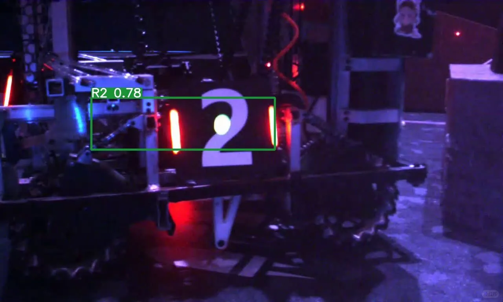
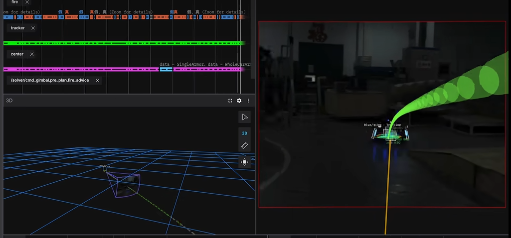

# 相机锁定自动瞄准

## 自动瞄准系统交互效果呈现（请点击）
你可以拖动瞄准的目标,看到计算的相机屏幕上目标的投影

<a href="../files/robo/robomaster_coordinate_transform_matrix_tracker_latest_version.html"
target="_blank">

打开 ↗

</a>

<a href="../files/robo/robomaster_coordinate_transform_matrix_tracker_latest_version.html"
download>

下载 HTML ↓

</a>

在 RoboMaster 机器人比赛中，我们经常需要使用坐标系变换方法，实现对高速平移、旋转目标的识别、定位与自动瞄准。

这是我本科阶段参与的一个机器人比赛项目，我主要负责机械设计以及部分电子工程工作。其中让我最满意的是设计了一套小巧的云台结构，通过合理的质量分布和重心控制，使整个系统保持了良好的稳定性，同时兼顾了体积和运动性能。

后来在学习 SFG/SHS 实验中的分子光谱分析时，我发现其中的思想与机器人自动瞄准系统存在一定的相似性：

实验中，我们通过光谱信息确定分子坐标系，再利用坐标变换将其转换到实验室坐标系；而 RoboMaster 自动瞄准系统中，同样需要通过不同坐标系之间的转换，将目标在相机坐标系中的位置转换到机器人控制系统中的参考坐标系。

因此，我按照矩阵变换的基本原理，将这个自动瞄准系统重新整理为一个交互式 HTML 文件，用于展示坐标变换、旋转矩阵以及目标追踪过程。

这一过程也为后续理解球坐标系中的 ZYZ 欧拉角旋转、D 矩阵、d Wigner 矩阵以及 Wigner-Eckart 定理等内容提供了一些直观基础。

如需查看相关参考资料，请跳转至文末：

[跳转到参考链接 ↓](#references)

这里放置两个比赛视频。

# 

</a>

---

# 参考链接

## RoboMaster 比赛介绍

RoboMaster 官方频道：

https://www.youtube.com/@RoboMaster/featured

## 比赛相关视频

视频 1：

https://www.bilibili.com/video/BV1nX9kBxEaN/

视频 2：

https://www.bilibili.com/video/BV1JconBaEkC/
