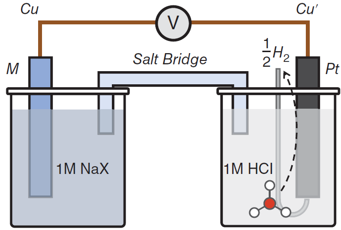
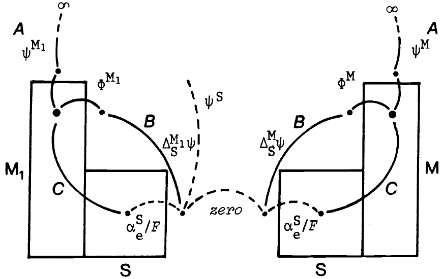

# 什么是电极电势

## 开头总结

这篇笔记想回答一个看起来简单、实际上牵涉电子结构、界面静电、化学势和参比体系的问题：我们测量**电极电势**的时候，到底在测什么？主线是从金属表面的电子结构出发，进入金属-水界面和双电层，再从 Trasatti 的绝对电极电势定义与计算化学的表达出发，理解实验中的相对电极电势、绝对电极电势、SHE、PZC，以及 AIMD 中电极电势的参比问题。

## 从电子结构走向带水界面

我们将从电极的电子结构,再说到带水界面.

这一期是关于一个很简单但是却非常深奥的科学问题,什么是电极电势?

### 为什么“金属和溶液之间的电势差”还不够

你可能觉得这个问题非常简单不就是金属和溶液之间的电势差吗?但是这个想法是错误的. 或者当我们讨论什么是**绝对电极电势（absolute electrode potential）**的时候,你会觉得这不就是一个选择参考点的问题,我可以选真空或者H电极作为参考点,其他的电极电势和它组成一个系统看看其他相对于它的电极电势是多少就好了.但是选取不同的参考点会导致引入不可计算和不可测的物理量.所以这不是一个简单的问题.

### 从 Frumkin、Trasatti 到计算电化学

但实际上,这个简单的问题电化学家从苏联科学院**A.N. Frumkin**院士再到**Sergio Trasatti** \[6\] ,再到现在人们用计算化学手段去计算电极电势和理解电极电势在电化学电催化中的作用,以及最近人们的**SFG**光谱直接测量表面电场或者**PZC（零电荷电势）**.大概从1960年走到了2021年.一共60年.

### 从 d-band center 进入这个问题

我对这个问题一开始毫不感兴趣,感觉这就是一个高中学生会遇到的问题,无聊的考试. 让我介绍一下我是如何走进这个问题的.一开始我是对Nørskov的**d-band center**感兴趣. 我们在另一篇笔记中提到了完整的推导过程.\[1\]

它描述可以用金属 d 轨道的积分中心位置来衡量分子在表面吸附的强弱。**实际上，这并不是因为金属的 d 轨道和分子的轨道相互作用最强。分子首先会和金属宽广的 sp 带发生极强的相互作用，但因为不同过渡金属的 sp 带非常宽且特征相似，这种相互作用在不同金属上贡献的吸附能差不多是一个常数。**

### d-band center 到电化学以后为什么不够了

但是当d-band center进入电化学却发现遇到了更大的问题,在溶液中的分子周围裹挟着水,界面自然的出现了**双电层**,所以一切都变得不那么简单,简单的d-band center在溶液中渐渐失效.

所以我们需要从纯金属表面的电子结构过渡到金属-溶液界面.

## 我真正想问的问题

#### 于是我开始接触双电层结构是如何形成的?

#### 这与金属表面的电子结构有什么关系?

#### 如果对不同金属施加同一个大小的电极电势双电层结构会有什么不同?

#### 金属中的电子是怎么向溶剂转移的?电子转移是怎么发生的? 金属表面附近的溶剂结构是怎么样的?

#### 我能不能用光谱(SFG,**SHS**)看到溶剂结构,甚至是重组能?

#### 这样的溶剂结构是怎么影响电子转移的?

## 从 absolute electrode potential 开始

我们先介绍什么是absolute electrode potential 开始, 从Trasatti和计算化学的角度(*Atomic-Scale Modelling of Electrochemical Systems*, Jia-Bo Le, Jun Cheng, Chapter 5)\[2\],

首先我们先说明,你测的电极电势并不是你想的金属和溶液的电势差，还包括化学贡献（吉布斯能差）,那怕我们已经有**AIMD**等手段,计算化学直到今天都不太清楚自己的计算在什么电极电势下.

我们现在来介绍什么是电极电势,介绍的过程会涉及到很多的参数,我每次看过一段时间就忘记了.所以我们只要了解其中的物理意义,不要去记住这些量具体的名字.

# 电极电势与绝对电极电势的理论推导

{width="409"}

下面这一部分我把jun cheng(最新一代计算电极电势的学者)和Trasatti(最早研究电极电势的学者)的版本结合在一起,希望能帮助你的理解.

## 1. 电压表真正测量的是什么

如图 1 所示的电化学系统，中间连接的电压表不仅受到静电场的影响，还受到化学势的驱动。因此，测量得到的电极电势本质上是电压表两端测量引线中的**电子电化学势（Electrochemical Potential）之差**\[2\]：

$$
U=
\frac{
\tilde{\mu}_e^{\mathrm{Cu}}
-
\tilde{\mu}_e^{\mathrm{Cu}'}
}{
-e_0
}
\tag{5.1}
$$

### 电子电化学势包含化学贡献和静电贡献

其中，$\tilde{\mu}_e^{\mathrm{Cu}}$ 和 $\tilde{\mu}_e^{\mathrm{Cu}'}$ 分别代表连接工作电极和参比电极的 Cu 导线中电子的电化学势，$-e_0$ 为单个电子的电荷量\[2\]。Cu 导线中电子的电化学势由化学贡献和静电贡献两部分组成\[2\]：

$$
\tilde{\mu}_e^{\mathrm{Cu}}
=
\mu_e^{\mathrm{Cu}}
-
e_0\phi^{\mathrm{Cu}}
\tag{5.2}
$$

此处 $\mu_e^{\mathrm{Cu}}$ 是电子的化学势，而 $\phi^{\mathrm{Cu}}$ 是 Cu 的**内电势（Galvani Potential）**。内电势的严格物理意义是将单位正电荷从无穷远真空移入金属**体相内部**所需做的静电功。

### 相同金属终端让化学势贡献抵消

注意，工作电极和参比电极最终接入电压表的终端通常是相同的金属（如 Cu）。因此，该电池的工作电极电势可简化表达为两终端的内电势之差\[2\]：

$$
U
=
\phi^{\mathrm{Cu}}
-
\phi^{\mathrm{Cu}'}
\tag{5.3}
$$

### 把总电势差拆成各个界面

我们可以通过加上各个相界面的内电势，将公式 (5.3) 展开为级数形式\[2\]：

$$
U
=
(\phi^{\mathrm{Cu}}-\phi^{M})
+
(\phi^{M}-\phi^{S})
+
(\phi^{S}-\phi^{\mathrm{Pt}})
+
(\phi^{\mathrm{Pt}}-\phi^{\mathrm{Cu}'})
\tag{5.4}
$$

其中，$\phi^{\mathrm{Pt}}$、$\phi^{S}$ 和 $\phi^{M}$ 分别代表**标准氢电极 (SHE)** 中的 Pt、电解质溶液 $S$ 以及工作电极 $M$ 的内电势\[2\]。由于金属 $M$ 与终端 Cu 在电池中直接接触并达到电子热力学平衡（费米能级拉平），即：

$$
\tilde{\mu}_e^{M}
=
\tilde{\mu}_e^{\mathrm{Cu}}
\tag{5.5}
$$

### 用电子热力学平衡改写接触项

因此，公式 (5.4) 右侧的第一项可改写为\[2\]：

$$
\phi^{\mathrm{Cu}}
-
\phi^{M}
=
\frac{1}{e_0}
\left(
\mu_e^{\mathrm{Cu}}
-
\mu_e^{M}
\right)
\tag{5.6}
$$

同理，公式 (5.4) 的最后一项可表示为\[2\]：

$$
\phi^{\mathrm{Pt}}
-
\phi^{\mathrm{Cu}'}
=
\frac{1}{e_0}
\left(
\mu_e^{\mathrm{Pt}}
-
\mu_e^{\mathrm{Cu}'}
\right)
\tag{5.7}
$$

### 得到只包含单电极属性的形式

将公式 (5.6) 和 (5.7) 代回公式 (5.4) 并重新整理各项，由于两终端均是 Cu，其化学势互相抵消，我们得到：

$$
U
=
\left[
(\phi^M-\phi^S)
-
\frac{\mu_e^M}{e_0}
\right]
-
\left[
(\phi^{\mathrm{Pt}}-\phi^S)
-
\frac{\mu_e^{\mathrm{Pt}}}{e_0}
\right]
\tag{5.7b}
$$

------------------------------------------------------------------------

## 2. 引入绝对电极电势与常数 $K$

### 约化单电极电势

此时，我们引入 Trasatti (1986) 在 IUPAC 报告《THE ABSOLUTE ELECTRODE POTENTIAL: AN EXPLANATORY NOTE》中的理论\[3\]。

公式 (5.7b) 方括号中的每一项仅包含单一电极自身的属性，因此被定义为**约化单电极电势（Reduced Single Electrode Potential）** $E^{\mathrm{M}}(r)$\[3\]：

$$
E^{\mathrm{M}}(r)
=
(\phi^M-\phi^S)
-
\frac{\mu_e^M}{e_0}
\tag{5.7a}
$$

（注：若采用摩尔尺度，分母的 $e_0$ 即替换为法拉第常数 $F$\[3\]）。

### 从约化单电极电势到绝对电极电势

真正的绝对电极电势 $E^{\mathrm{M}}(\mathrm{abs})$ 与约化单电极电势的关系可以通过引入一个参考系常数 $K$ 来表达\[3\]：

$$
E^{\mathrm{M}}(\mathrm{abs})
=
E^{\mathrm{M}}(r)
+
K
\tag{5.7c}
$$

### 常数 $K$ 的物理意义

**常数** $K$ 的物理意义在于：它代表了我们将电子从体系中移出时，所人为选定的“绝对参考状态（Reference state）”。 从热力学推导可知，常数 $K$ 的统一表达式为\[3\]：

$$
K
=
\phi^S
+
\frac{\tilde{\mu}_e^{\mathrm{ref}}}{F}
\tag{5.7d}
$$

其中 $\tilde{\mu}_e^{\mathrm{ref}}$ 是电子在该绝对参考态下的电化学势\[3\]。你可以选择不同的物理状态作为参考点，从而得到不同物理意义下的 $K$\[3\]。

{width="460"}

结合图 2，探讨三种不同的参考路径（即三种 $K$ 的选择）对单电极电势定义的影响：

## 3. 三种绝对参考路径

### 3.1 路径 A (Path A)：移动到“无穷远处的真空”

- **物理情境**：如图 2 虚线 A 所示，电子从金属内部移动到距离系统无限远的真空中\[3\]。
- **计算方式**：在无穷远处，电子既没有化学相互作用（化学势为 0），静电势也被定义为绝对零点（$\psi = 0$）。因此，参考态的电化学势 $\tilde{\mu}_e^{\mathrm{ref}} = 0$\[3\]。

代入常数公式：

$$
K
=
\phi^S
+
\frac{0}{F}
=
\phi^S
\tag{5.7e}
$$

- **结论**：如果选无穷远为参考点，常数 $K$ 直接等于溶液的内电势 $\phi^S$\[3\]。但这不符合常规表面物理实验的测量习惯\[3\]。

### 3.2 路径 C (Path C)：移动到“溶液内部” (溶剂化电子)

- **物理情境**：如图 2 实线 C 所示，电子从金属内部直接进入溶液相 S，变为溶剂化电子\[3\]。

*图 2 标注解释*：图中 $\alpha_e^S$ 代表电子在溶液中的**真实势（Real Potential）**，定义为将一个电子从溶液表面外侧真空移入溶液体相内部所做的功：

$$
\alpha_e^S
=
\mu_e^S
-
F\chi^S
\tag{5.7f}
$$

它代表溶剂网络吸纳电子的做功能力，物理意义上类似于溶液相对应于电子的“负功函数”\[3\]。

- **计算方式**：电子的参考状态是“浸泡在溶液内部的溶剂化电子”，其在溶液体相中的电化学势为：

$$
\tilde{\mu}_e^S
=
\mu_e^S
-
F\phi^S
\tag{5.7g}
$$

代入常数公式：

$$
K
=
\phi^S
+
\frac{\mu_e^S-F\phi^S}{F}
=
\frac{\mu_e^S}{F}
\tag{5.7h}
$$

- **结论**：如果选溶剂化电子为参考点，常数 $K$ 等于溶液中电子的化学势（除以 $F$）\[3\]。因为该值强烈依赖于具体溶剂种类，故不具备普适性\[3\]。

### 3.3 路径 B (Path B)：移动到“靠近溶液表面的真空”（IUPAC 强烈推荐）

- **物理情境**：如图 2 实线 B 所示，电子悬停在两相表面之间的气隙（真空）中\[3\]。
- **计算方式**：在这个状态下，电子位于紧挨着溶液表面的真空中。此时电子不受溶液内部化学环境的影响（化学势为 0），但仍然处于溶液宏观剩余电荷产生的静电场中，这个静电势即溶液的**外电势** $\psi^S$\[3\]。

因此，参考态的电化学势：

$$
\tilde{\mu}_e^{\mathrm{ref}}
=
-F\psi^S
\tag{5.7i}
$$

代入常数公式：

$$
K
=
\phi^S
-
\psi^S
\tag{5.7j}
$$

根据静电学定义，相的内电势等于外电势加上表面电势（偶极电势），即：

$$
\phi^S
=
\psi^S
+
\chi^S
\tag{5.7k}
$$

因此：

$$
K
=
(\psi^S+\chi^S)
-
\psi^S
=
\chi^S
\tag{5.7l}
$$

- **结论**：选溶液表面外侧真空为参考点，常数 $K$ 等于纯溶剂的表面电势 $\chi^S$\[3\]。

## 4. 为什么路径 B 具有终极的实验可操作性？

采用路径 B（靠近界面的真空），测量过程被拆解为两个在物理上完全**可独立测量**的步骤\[3\]：

1.  **从金属内部** $\rightarrow$ 金属表面外侧真空：克服的能量恰好是金属的**电子功函数** $\Phi^M$\[3\]。
2.  **从金属表面外侧真空** $\rightarrow$ 溶液表面外侧真空：仅需克服这两点之间的静电势差，即**外电势差（接触电势差）** $\Delta_S^M\psi$\[3\]。

### 把功函数与外电势差合起来

将两步的能量合并，绝对电极电势获得了一个极其优雅且完全由纯物理量构成的计算公式\[3\]：

$$
E^M(\mathrm{abs})
=
\Phi^M
+
\Delta_S^M\psi
\tag{5.7m}
$$

*(注：如果采用电势 V 为单位，功函数项常写为* $W_e^M/e_0$ 或 $\Phi^M/e_0$)\[2,3\]。

### 在 PZC 状态下

特别地，在零电荷电势（PZC）状态下，该绝对电极电势的定义演化为\[2\]：

$$
U_{\mathrm{PZC}}^{\mathrm{abs}}
=
\frac{\Phi^M}{e_0}
+
(\psi^M-\psi^S)
\tag{5.7n}
$$

------------------------------------------------------------------------

## 5. 与标准氢电极（SHE）的结合

### SHE 中的平衡反应

如图 1 所示，如果电池右侧的参比电极选用标准氢电极 (SHE)（若是 RHE 则需依据 Nernst 方程扣除 pH 影响），此时 Pt 电极电势应与以下半反应处于电化学平衡\[2\]：

$$
\mathrm{
H^+(aq)
+
e^-(vac)
\rightarrow
\frac{1}{2}H_2(g)
}
\tag{5.7o}
$$

### 平衡态热力学关系

因此，根据平衡态热力学\[2\]：

$$
\phi^S
-
\phi^{\mathrm{Pt}}
=
\frac{1}{e_0}
\left(
\frac{1}{2}\mu_{\mathrm{H_2}}^{g,o}
-
\mu_{\mathrm{H^+}}^{S,o}
-
\mu_e^{\mathrm{Pt}}
\right)
\tag{5.8}
$$

其中 $\mu_{\mathrm{H^+}}^{S,o}$ 和 $\mu_{\mathrm{H_2}}^{g,o}$ 分别代表溶剂化质子和氢气的标准化学势\[2\]。

### 得到以 SHE 为基准的一般电极电势表达式

结合之前展开的公式 (5.4)、(5.6)、(5.7) 与 (5.8)，我们便得到了以 SHE 为基准的**一般电极电势表达式**\[2\]：

$$
U
=
\frac{1}{e_0}
\left(
\frac{1}{2}\mu_{\mathrm{H_2}}^{g,o}
-
\mu_{\mathrm{H^+}}^{S,o}
-
\mu_e^{M}
\right)
+
(\phi^{M}-\phi^{S})
\tag{5.9}
$$

这就是实验中测量到的**相对电极电势**的微观热力学本质。

------------------------------------------------------------------------

## 6. 总结表格：电极电势的不同表达形式

### 只考虑一根电极

这是只考虑一根电极的

| **参考状态 (Reference State)** | **常数 K 的取值** | **绝对单电极电势 EM(abs) 的展开式** |
|------------------------------|----------------|---------------------------|
| **1. 无穷远处的真空** (Infinity in a vacuum) | $\phi^S$ | $\phi^M - \frac{\mu_e^M}{F}$ |
| **2. 溶液内部的溶剂化状态** (Solvated state in the liquid phase) | $\frac{\mu_e^S}{F}$ | $\Delta_S^M\phi - \frac{\mu_e^M}{F} + \frac{\mu_e^S}{F}$ |
| **3. 靠近溶液表面的真空** (A point in a vacuum close to the surface) | $\chi^S$ | $\frac{\Phi^M}{F} + \Delta_S^M\psi$ |

### 组合成 cell

这是组合成cell的

|  |  |  |  |
|--------------|--------------|-------------------------|-------------------|
| SHE reduced potential | Standard $\mathrm{H^+/H_2}$ equilibrium | $U_{\mathrm{SHE}}(r)=[\mu_{\mathrm{H^+}}^{S,o}-\tfrac12\mu_{\mathrm{H_2}}^{g,o}]/e_0$ | Reduced single-electrode potential of the SHE |
| SHE absolute potential | Path-B absolute reference | $U_{\mathrm{SHE}}^{\mathrm{abs}}\approx4.44\ \mathrm{V}$ at 298.15 K | Absolute electronic-energy position of the SHE relative to vacuum outside water |
| Working electrode vs SHE | SHE chosen as relative zero | $U^{\mathrm{SHE}}=U^M(r)-U_{\mathrm{SHE}}(r)=U^M(\mathrm{abs})-U_{\mathrm{SHE}}^{\mathrm{abs}}$ | Experimentally reported electrode potential on the SHE scale |
| Absolute PZC | $\sigma_M=0$ | $U_{\mathrm{PZC}}^{M,\mathrm{abs}}=[\Phi^M/e_0+\Delta_S^M\psi]_{\sigma_M=0}$ | Absolute electrode potential evaluated at zero excess surface charge |
| PZC vs SHE | $\sigma_M=0$, SHE reference | $U_{\mathrm{PZC}}^{\mathrm{SHE}}=U_{\mathrm{PZC}}^{M,\mathrm{abs}}-U_{\mathrm{SHE}}^{\mathrm{abs}}$ | PZC reported on the conventional SHE scale |

## 7. 如果还想把内电势、外电势继续拆开

如果你想搞清楚内电势 外电势等等具体的定义,可以去问AI加上下面这个视频中有一幅图可以帮助你理解,\[7\]

我们弄清楚这些关系,我们就可以得到不同的表达电极电势的方程.

## 8. 从实验参比进入 AIMD 的电势标定

厦门大学计算化学的程俊有两篇PRL就是用AIMD把上面这些参比找到,并且计算,从而推导出PZC PZFC \[4,5\]

### SHE在实验上参比到哪里,在计算上又参比到哪里?我怎么知道我跑的AIMD是在什么电极电势下?

## 9. 下一步：DFT 中的恒电势

### DFT计算上的恒电势是什么意思? 这个又是一个大坑\[8\]

## 参考文献

\[1\] Nørskov, J. K.; Abild-Pedersen, F.; Studt, F.; Bligaard, T. “Density Functional Theory in Surface Chemistry and Catalysis.” *Proceedings of the National Academy of Sciences* **108** (3) (2011): 937–943. https://doi.org/10.1073/pnas.1006652108

\[2\] Le, J.-B.; Yang, X.-H.; Zhuang, Y.-B.; Wang, F.; Cheng, J. “Ab initio modeling of electrochemical interfaces and determination of electrode potentials.” In *Atomic-Scale Modelling of Electrochemical Systems*, Chapter 5, pp. 173–200. Wiley, 2021. https://doi.org/10.1002/9781119605652.ch5

\[3\] Trasatti, S. “The absolute electrode potential: an explanatory note (Recommendations 1986).” *Pure and Applied Chemistry* **58** (7) (1986): 955–966. https://doi.org/10.1351/pac198658070955

Trasatti, S. "The “absolute” electrode potential—the end of the story" Electrochimica Acta 1990 https://www.sciencedirect.com/science/article/abs/pii/001346869085069Y

\[4\] Cheng, J.; VandeVondele, J. “Calculation of Electrochemical Energy Levels in Water Using the Random Phase Approximation and a Double Hybrid Functional.” *Physical Review Letters* **116** (2016): 086402. https://doi.org/10.1103/PhysRevLett.116.086402

\[5\] Le, J.; Iannuzzi, M.; Cuesta, A.; Cheng, J. “Determining Potentials of Zero Charge of Metal Electrodes versus the Standard Hydrogen Electrode from Density-Functional-Theory-Based Molecular Dynamics.” *Physical Review Letters* **119** (2017): 016801. https://doi.org/10.1103/PhysRevLett.119.016801

\[6\] 材料牛. Sergio Trasatti 相关文章（原文提供链接）. http://www.cailiaoniu.com/?p=235685

\[7\] 蔻享学术视频（原文提供链接）. https://www.koushare.com/video/details/65721?series_id=2064

\[8\] Bilibili 视频：DFT计算上的恒电势（原文提供链接）. https://www.bilibili.com/video/BV1pK411k7iq/